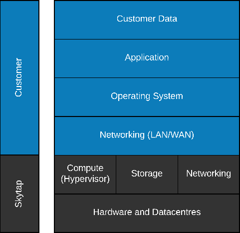

## **Connectivity**

**Summary**

Building a reliable network in the cloud is different from
traditional on-premise environments. While historically you may have
purchased levels of redundant higher-end hardware to minimize the chance
of an entire network stack failing, in the cloud, we acknowledge
up front that failures will happen. Instead of trying to prevent
failures altogether, the goal is to minimize the effects of a single
failing component. .

## Key Points

**Skytap-owned versus customer-owned responsabilities**

*Figure 2 -- Shared Responsibility Model*

## Choosing the right design

- [Internal Networking](../../security/internalnetworking.md)
- [Edge Networking](../../security/edgenetworking.md)

## Getting started with IBM Cloud

- VPN

- PNC/Equinix

## Getting Started with Azure

- VPN

- [Express Route/Global Reach](/ExpressRoute/skytap2azureexpressroute.md)

## vWAN 

## Considerations on Reliability

Next Steps
