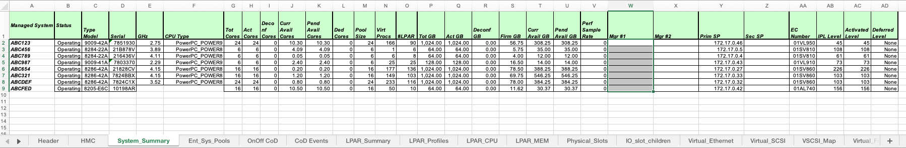
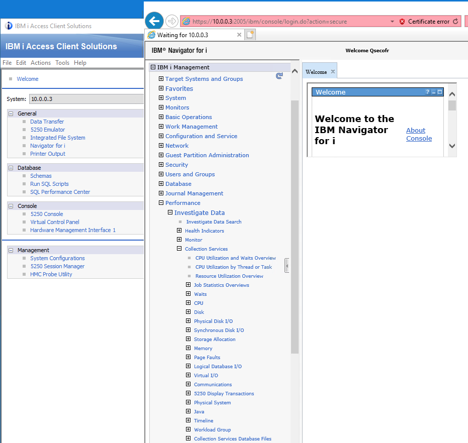
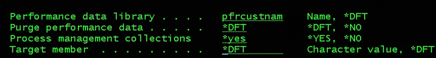
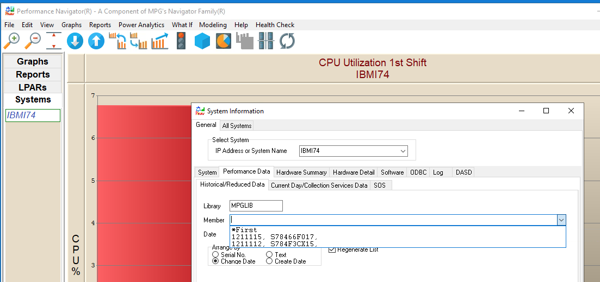
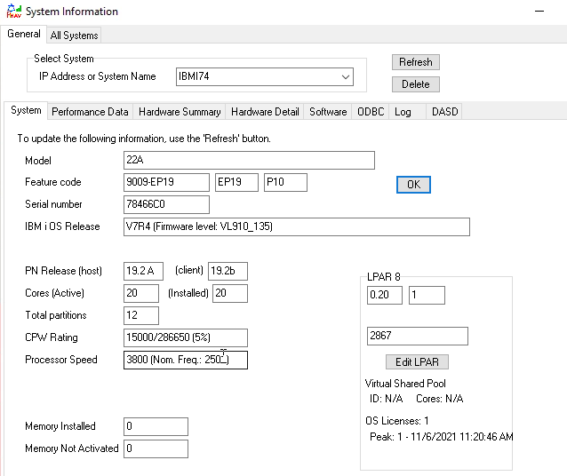
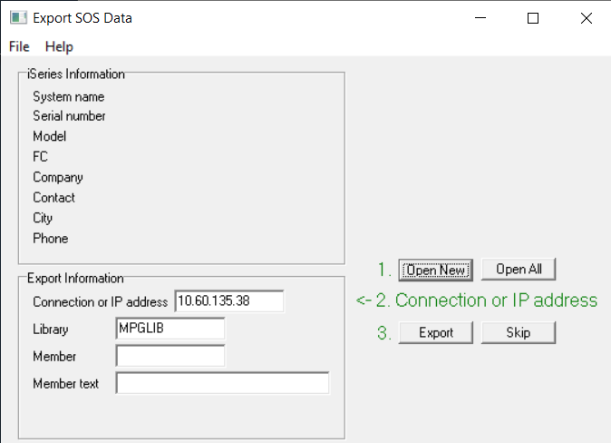
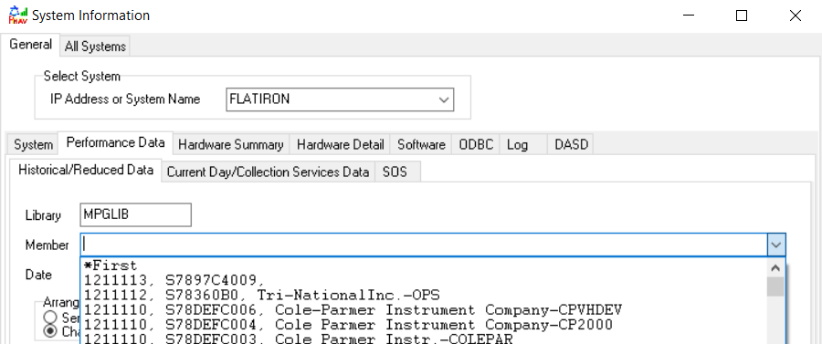
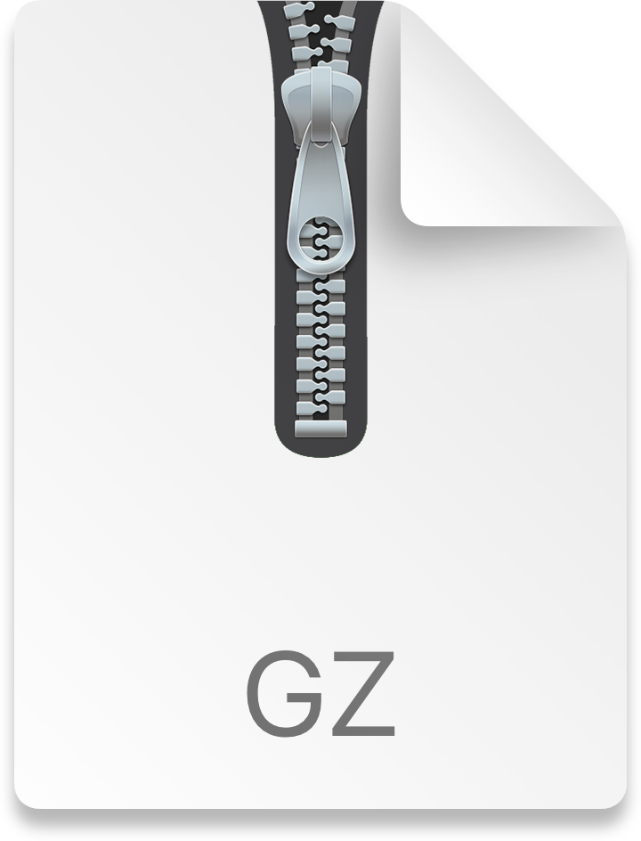
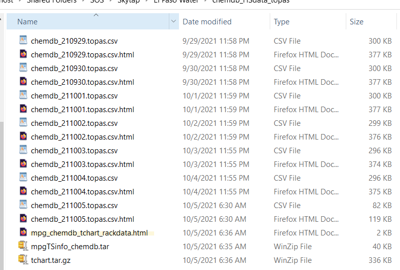
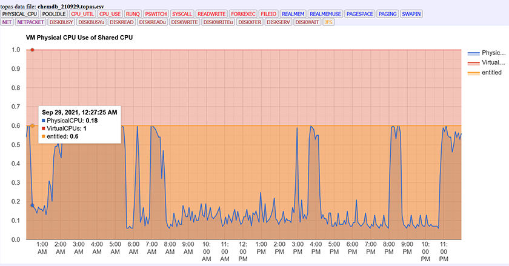

# Gathering Infrastructure and/or Performance Data for IBM Power (IBM i, AIX/VIOS, Linux)

Gathering infrastructure and/or performance data is an important step to
shortening the time required to optimize the performance of IBM Power in
Skytap on Azure or Skytap on IBM Cloud.

The only way to ensure the best performance experience for IBM Power in
Skytap's infrastructure is to have a complete understanding of your
current hardware configuration(s) and performance data. This includes
the IBM Power model, IBM PowerVM settings, disk models and
configuration, memory allocation(s) and performance metrics for all the
above.

The following section outlines options for accessing and gathering the
infrastructure and/or performance data, including the pros and cons of
each option. At a minimum, infrastructure data is required to help
configure each VM close to the current configuration.

# Tooling for Power Discovery (Infrastructure)

## HMC Scanner for POWER Servers 

**Pros:**

-   Contains the hardware infrastructure configuration for all systems
    connected to the HMC.

-   Supports multiple OS's -- Windows, Linux, AIX, IBM i

**Cons:**

-   Memory - only allocation data, no performance data.

-   Disk -- only allocation data, no performance data.

***Notes:***

*Data collection need to be explicitly enabled on the HMC since it is
not active by default. Easiest way to enable it is to log into the HMC
with administrative rights on the command line and issue the following
command: **chlparutil -r config -s 300**. This will enable data
collection for all current managed system on the HMC but not on future
ones. Just wait for a couple of days and the scanner will provide
performance data.*

*You can check if data collection is active by looking at scanner\'s
report. Select the System Summary tab and look at the Perf Sample
Rate column: if the cell is empty or has a zero value, data collection
is not active.*

**Output:** Excel spreadsheet

**Requirements:**

-   HMC Scanner runs on the Java Runtime Environment (Version 8) can be
    downloaded from the link below.

<https://www.java.com/en/download/manual.jsp>

-   Requires network access from the Windows PC to the HMC

-   This requires access to the HMC, hscroot ID and PW.

Use the HMC Scanner to quickly extract all the details of the POWER
Servers the HMC is connected too and saved in a Microsoft Excel
spreadsheet.\
The tool is available at the end of this document as a zip file that
needs to be extracted on an empty directory. Latest version is \"
[hmcScanner-0.11.42.zip](https://www.ibm.com/support/pages/system/files/inline-files/$FILE/hmcScanner-0.11.42.zip)\".

HMC Scanner is a Java program that uses SSH to connect to an HMC or SDMC
or FSM or IVM (IVM is experimental), downloads the system configuration
and produces a single Excel spreadsheet that contains the configuration
of servers and LPARs. In PureFlex environments, only Power Systems
compute nodes are detected. Optional HTML and CSV outputs are available

The result is a straightforward way to document configuration and to
easily look at most important configuration parameters.

Excel information is organized in tabs:

-   System summary: name, serial number, cores, memory, service
    processor IP for each server

-   LPAR Summary: list of all LPAR by serve with status, environment,
    version, processor mode

-   LPAR CPU: processor configuration of each LPAR

-   LPAR MEM: memory configuration of each LPAR

-   Physical Slots: list of all slots of each system with LPAR
    assignment, description, physical location and drc_index

-   Virtual Ethernet: network configuration of each virtual switch and
    each LPAR

-   Virtual SCSI: configuration of all virtual SCSI adapters, both
    client and server

-   VSCSI Map: devices mapped by each VIOS to partitions

-   Virtual Fibre: virtual fibre channel configuration of client and
    server with identification of physical adapter assigned

-   SEA: SEA configuration and statistics for all VIOS

-   SW Cores: LPAR and virtual processor pool configuration matrix to
    compute the number of software licenses. Simulation of alternative
    scenarios is possible.

With optional flags it is possible to download historical CPU usage data
from HMC and to add it in the report. HMC performance data collection
needs to be enabled on the HMC before running the scanner or the report
will only have empty fields. Data collection is *off *by default on the
HMC. The following tabs are related to managed system performance:

-   CPU Pool Usage: monthly average history of CPU usage of each system.

-   Sys RAM Usage: monthly average history of physical memory assignment
    to each LPAR.

-   LPAR CPU Usage: monthly average history of CPU usage of each LPAR.

-   CPU Pool Daily Usage: 1 year of CPU usage of every pool and
    sub-pools of each system. Based on daily averages.

-   LPAR Daily Usage: 1 year of CPU usage of every LPAR of each system.
    Based on daily averages.

-   CPU Pool Hourly Usage: 2 months of CPU usage of every pool and
    sub-pools of each system. Based on hourly averages.

-   LPAR Hourly Usage: 2 months of CPU usage of every LPAR of each
    system. Based on hourly averages.

The tool is constantly updated to match changes in tool syntax, to
manage new data types and to add new features. If you have any problem
or any suggestion to improve HMC Scanner, please send Federico Vagnini
in IBM, Italy an email (<vagnini@it.ibm.com>). Since new features are
mostly suggested by users, propose yours! Please always include the
downloaded files to allow be proper debugging.

This tool is not officially supported by IBM. No guarantee is given or
implied, and you cannot obtain help from IBM. It is a personal project
of the author, Federico Vagnini (IBM Italy).

See
also [pGraph](https://www.ibm.com/developerworks/community/wikis/home?lang=en#!/wiki/Power%20Systems/page/pGraph) page
form the same author. It allows multiple nmon, vmstat, iostat, sar,
lslparutil files to be loaded regardless of their size. Graphs are
provided together with a very useful \"time zoom\" that allows you to
select the time period to show.

[[https://www.ibm.com/support/pages/hmc-scanner-power-server-config-and-performance-stats]{.ul}](https://www.ibm.com/support/pages/hmc-scanner-power-server-config-and-performance-stats)

### **Running HMC Scanner on Windows PC:**

HMC scanner must be used on a system with Java 1.6 or later available
that is capable of contacting HMC with a direct SSH connection or using
an SSH connection through a HTTP, SOCKS4 or SOCKS5 proxy server. The HMC
must allow remote SSH command execution.

Please follow the following steps:

1\. Download the latest available code since it contains latest fixes
and capabilities. You can find it at the end of this document as a zip
file

2\. Unzip the code into a new empty directory

3\. Inspect the *hmcScanner.ksh* and *hmscScanner.bat* files to check if
they are able to locate Java executable on your system

4\. If you want to collect performance data, make sure data collection
was enabled (activation instructions are above)

5\. Run the scanner by providing HMC address, user and password

Example of Windows command:

> ***C:\\user\\rwatson\\downloads\\hmcscanner.bat \<HMC IP> -p xxxxxx
> -stats -sanitize -p=IP address, -stats=collect stats, -sanitize=remove
> IP addresses***

An example of the spreadsheet is below. Note the tab at the bottom which
shows all of the frames (serial numbers) connected to this HMC. The LPAR
and configurations can be found in the other tabs.

{width="7.5in"
height="1.2361111111111112in"}

Send the resulting spreadsheet to Skytap for analysis.**\
**

*Note: If you do not provide a password on the command line, the scanner
will use on Unix the public key located in \$HOME/.ssh/id_rsa or the one
provided with the -key parameter (the key must not have a password). If
no key is available, the scanner will ask for the password interactively
(not suited for batch processing)*

**\
**

**\
**

## **Native Power Discovery for IBM i**

IBM i operating systems automatically collect hardware and performance
data via Collection Services. This data has more detailed data regarding
hardware resource consumption and more details regarding the memory and
disk configuration / performance. There are 3 options to package this
data and send it to Skytap for analysis.

Option 1: Manually create a save file of \*MGTCOL

Option 2: Use Must Gather Tools to create the save file

Option 3: Use Performance Navigator to collect historical data

**\
**

### **Option 01:** Save file of \*MGTCOL object

**Pros**:

-   Contains 1-5 days of Collection Service data which has ALL
    infrastructure and performance data for each partition.

**Cons:**

-   Large file(s) = 1-50GB from each partition**.**

-   An analyst must upload to an IBM i partition, restore, and use
    performance tools, as well as Navigator for IBM i or other
    third-party products to analyze.

**Output:** IBM i save file from each partition

*Examples of IBM i commands from each partition:*

> ***crtsavf qgpl/pfrcustnam***
>
> ***savobj obj(\*mgtcol) lib(qpfrdata) dev(\*savf)
> savf(qgpl/pfrcustnam) dtacpr(\*yes)***

Then send the save file pfrcustnam to Skytap (via sftp) - TBD

A Skytap Cloud Solutions Architect or Cloud Solutions Engineer will then
do the following on an IBM i VM for your data:

***crtsavf qgpl/pfrcustnam***

***SFTP PFRCUSTNAM to pfrcustnam (save file on IBM i VM)***

***crtlib pfrcustnam***

***RSTOBJ OBJ(\*ALL)***

***SAVLIB(QPFRDATA)***

***DEV(\*SAVF)***

***SAVF(QGPL/PFRCUSTNAM)***

***RSTLIB(PFRCUSTNAM)***

Crtpfrcol frommgtcol(pfrcustnam/Qxxxhhmmss) tolib(pfrcustnam)

NOTE: Qxxxhhmmss is the member name of the \*MGTCOL object

If you are using **Navigator for i** to look at the data, then start the
ACS, click on *Navigator for i*, investigate data, Collection Services,
and select a metric.

{width="7.5in"
height="7.111111111111111in"}

Select a metric and then select your performance data library PFRCUSTNAM
from the pull-down field, select the Collection name if multiple and
display.

{width="4.875in"
height="3.875in"}

If using Performance Navigator prompt (F4) the following command on the
IBM i command line:

mpglib/mpgdr

{width="7.5in"
height="1.0138888888888888in"}

**Note:** change the Performance data library to your performance data
library and Process management collection to \*yes and hit enter.

Start Performance Navigator, make sure you are connected to your IBM i
VM and go to the View System Info / Performance Data tab and click the
down arrow to select the new data.

{width="7.5in"
height="3.5416666666666665in"}

Your system(s) name will show up in the navigator panel on the left. You
can see your hardware configuration via the View / System Information
options. Note: The Performance Navigator client track connection with
system names. If you are connecting to a second system with the same
name you have to create an alias. Just go to Edit / System options /
click the HA tab and select System 1. Close and restart Performance
Navigator. You should now see the system name with an '\_1' at the end.

{width="6.645833333333333in"
height="5.583333333333333in"}

There are three free graphs available without a keycode:

1.  Graphs / CPU / by priority

2.  Graphs / Disk / space utilization

3.  Health Check

To have full access to all the data you need to enter a keycode. Once
you receive the temporary keycode, go to Edit / System Options / Keycode
and enter the key. Close and reopen the program to have full access.

{width="5.229166666666667in"
height="2.5520833333333335in"}

**\
**

### **Option 02:** Using Must Gather Tools

**Pros**: Follow instructions below on each partition. Option 'b' disk
data is a small output \~2-10MB

**\
Cons**: 70+ text file. Must be V7R2 and above. Snapshot of current
configuration \~xxGB.

**\
Output**: Zip file called - \<system name>\_SYSSNAP_202108271403.zip or
/tmp/diskmetrics\_\<sysnam>.zip for disk only data.

1\. Little or no historical data

  a. If you are at V7R2 IBM i or later do the following:

      1. Go to the Must Gather Tools menu - GO QMGTOOLS/MG

      2. First check for any updates, option 13

3\. Select option 3 - Performance/Mics collection

      3. Select option 3 - Collection Services

      4. Select option 2 - Copy Performance Data - This option will
create a save file of one or more Collection Services data. The save
file will be \'xx\' GB in size. This will give us the infrastructure and
performance data from that one day.

          Set option Save file to \"Y\" and hit enter

          Select the first QxxxHHMMSS member not in use and hit enter

       5. Send Skytap the save file that is created in the IFS in
directory /tmp/IBMCSDATA/IBMDATA002 -TBD

   b. If all Skytap needs access to is the disk metrics then do the
following:

       1. Go to the Must Gather Tools menu - GO QMGTOOLS/MG

       2. Select option 3 - Collection Services

       3. Select option 15 - Collect disk metrics from CS

       4. Next screen hit enter

       5. This will create a zip file in /tmp/diskmetrics\_\<sysnam>.zip

       6. Send Skytap the diskmetrics zip file

Note: There will be 70+ .csv or txt files available.

**\
**

### **Option 03**: Performance Navigator from HS

**Pros**: Automates the historical collection of infrastructure and
performance data -- Small file to send \~1-10MB. Exclusive What-If
function to model workload to different systems. Can track every job and
user resource consumption history. Helps to address performance
questions. Free access to infrastructure data and high-level CPU
utilization and disk space (both installed and used).

**Cons:** Access to full options requires license.

Collecting historical data with no overhead and little disk space:

   a. download a Windows Client and IBM i host code using the following
links:

[[https://hsdownloads.helpsystems.com/software/robot/performance-nav/pn400.sav]{.ul}](https://nam11.safelinks.protection.outlook.com/?url=https%3A%2F%2Fhsdownloads.helpsystems.com%2Fsoftware%2Frobot%2Fperformance-nav%2Fpn400.sav&data=04%7C01%7CRandy.Watson%40helpsystems.com%7Cf3a8180e57a34df3b3d908d97c91eb4f%7Cca81e23b350945eea9983e346acf274d%7C0%7C0%7C637677791505384352%7CUnknown%7CTWFpbGZsb3d8eyJWIjoiMC4wLjAwMDAiLCJQIjoiV2luMzIiLCJBTiI6Ik1haWwiLCJXVCI6Mn0%3D%7C3000&sdata=2euT7CjBenbQim7wJnBIUr14TpNVXLw%2FyMZdWd5B6lc%3D&reserved=0)

[[https://hsdownloads.helpsystems.com/software/robot/performance-nav/perfnav.exe]{.ul}](https://nam11.safelinks.protection.outlook.com/?url=https%3A%2F%2Fhsdownloads.helpsystems.com%2Fsoftware%2Frobot%2Fperformance-nav%2Fperfnav.exe&data=04%7C01%7CRandy.Watson%40helpsystems.com%7Cf3a8180e57a34df3b3d908d97c91eb4f%7Cca81e23b350945eea9983e346acf274d%7C0%7C0%7C637677791505394306%7CUnknown%7CTWFpbGZsb3d8eyJWIjoiMC4wLjAwMDAiLCJQIjoiV2luMzIiLCJBTiI6Ik1haWwiLCJXVCI6Mn0%3D%7C3000&sdata=IufUy4zr%2F%2BCKDVyGdUcjGkzDkZnl87ViGSBScY1aNtM%3D&reserved=0)

   b. Click on perfnav.exe to install the Windows component. This is a
self-extracting install program that just puts an ICON on the desktop.

   c. The first time you launch perfnav, it will prompt you to install
the IBM i host code pn400.sav. Reply YES.  A PN400 install window will
appear.

   d. In tab 1.local, browse to the pn400.sav file you downloaded. Then
follow tab 2-5 on each partition

{width="6.34375in"
height="2.4791666666666665in"}

   e. Following a minimum period of 24 hours, start Perfnav and reply NO
to the PN400.sav install. In the System Information window, enter the
system name or IP address of the first LPAR and hit NEW. **Note:** This
will create a connection to the partitions using ACS ODBC driver.

   d. Connect to all the other LPARs via the File / New IBM i, enter
system name or IP address and click NEW.

   e. Once connected to all LPARs, go to **File/SOS**, highlight the
first system name and Shift Click the last system name. Then click Save
to Disk. This will create one file for each partition called
sos_serial#xx.GpD. Note the directory in the log.

{width="6.5in"
height="2.78125in"}

   f. Then email Skytap the SOS files. They are usually very small
(1-3MB).

Upload SOS file to IBM i VM:

1.  Upload the SOS data using the Windows program SOS3

2.  Open the SOS file with Open All

3.  Enter IP address of the IBM i VM to store data

4.  Click Export

This will add a member to the Performance Navigator file on the IBM i
VM.

{width="7.020833333333333in"
height="5.083333333333333in"}

To connect the Performance Navigator client to the data, go to View /
System Info for the IBM i VM, click the Performance Data tab, then the
down arrow by the member\'s name and select the member.

{width="7.5in"
height="3.138888888888889in"}

## Native Power Discovery for AIX via VIOS

AIX and VIOS automatically collect hardware and performance data via
Topas. One simple script can consolidate the data and create one file to
be sent to the analysis. There are 3 options to collect hardware and
performance data.

Options 1: Collect the 7 days of Topas data

Option 2: Use existing nmon data

Option 3: Install Performance Navigator to collect historical nmon data.

**\
**

### **Option 01**: Collecting Topas data 

1.  Obtain the rackdata.tar.gz file from Skytap or:

    a.  Using WinScp or FileZilla, download rackdata.tar.gz from
        [[ftp.mpginc.com]{.ul}](ftp://ftp.mpginc.com)

2.  SFTP or FTP to **/tmp** on each LPAR

3.  Unzip and untar - **cd /tmp;**g**unzip -f rackdata.tar.gz;tar -xvf
    rackdata.tar;./rackdata.sh -T**

Send file in /tmp called pninfo_topas\_*hostname*\_2021mmdd_mmss.tar.gz
from each LPAR

**Pros**: By default AIX keeps 7 days of historical Topas data. Contains
infrastructure and performance data. Includes free graphic view of all
data using Google graphs.

**Cons**: Only 7 days of performance data, can only look at 1 day at a
time.

**Output**: 1 file per partition called
pninfo_topas\_\<hostname>\_date_time.tar.gz

{width="1.0104166666666667in"
height="1.0104166666666667in"}

File should be between 5-10MB.

To connect the custoners data to the Performance Navigator client do the
following:

1.  Unzip, untar the pninfo file

2.  From Performance Navigator go to FIle / New AIX/ Linux menu and
    browse to the directory for your data. Select the mpgdata2.hostname
    file and open.

3.  {width="7.5in"
    height="1.1388888888888888in"}

To view the Topas data via Google Chart:

Click on the LPARname_HSdata_topas folder for any given LPAR then click
the the mpg_hostname_tchart_rackdata.html

{width="7.5in"
height="5.055555555555555in"}

Click on one of the hostname_date_topas_cvs to see the one day with
Google Chart

{width="3.8958333333333335in"
height="6.020833333333333in"}

It will launch the browser to view the data for the one day with Google
Chart. Just click on any of the tabs at the top. The example below is
the Physical CPU graph:

{width="7.5in"
height="3.9166666666666665in"}

**\
**

### **Option 02**: Collecting existing nmon data

1.  Obtain your pnbuild.tar.gz file from Skytap or:

    a.  Using WinScp or FileZilla, download pnbuild.tar.gz from
        [[ftp.mpginc.com]{.ul}](ftp://ftp.mpginc.com)

2.  SFTP or FTP to the same directory where existing nmon exists.

3.  Unzip and untar - **cd /tmp;gunzip -f pnbuild.tar.gz:tar -xvf
    pnbuild.tar; ./pnbmpgd2gzip.sh**

4.  Send file called pninfo_multiple_AIX.tar.gz to Skytap

**Pros**: If you already have existing nmon data, Skytap can use this
data. Nmon data has more info than Topas. Usually more than seven days.
If you normally consolidate nmon data to a single shared directory, one
script will gather data from all partitions for free.

**Cons:** File could be large depending on the amount of history
(\~10-25GB). No graphical view

**Output**: 1 file containing all partition in shared directory called
pninfo_multiple_AIX.tar.gz

**\
**

### **Option 03:** Start collecting historical nmon data

**Pros**: Starts the management of the historical collection of nmon.
Includes graphic view of last 7 day with Google graphs for free.

**Cons**: Will have to wait one week or two to receive data.

**Output:** 1 file per partition called pninfo\_\<hostname>.AIX.tar.gz

1.  Download powernav.tar.gz from the link below:
    [[https://hsdownloads.helpsystems.com/software/robot/performance-nav/powernav.tar.gz]{.ul}](https://nam11.safelinks.protection.outlook.com/?url=https%3A%2F%2Fhsdownloads.helpsystems.com%2Fsoftware%2Frobot%2Fperformance-nav%2Fpowernav.tar.gz&data=04%7C01%7CRandy.Watson%40helpsystems.com%7Cf3a8180e57a34df3b3d908d97c91eb4f%7Cca81e23b350945eea9983e346acf274d%7C0%7C0%7C637677791505394306%7CUnknown%7CTWFpbGZsb3d8eyJWIjoiMC4wLjAwMDAiLCJQIjoiV2luMzIiLCJBTiI6Ik1haWwiLCJXVCI6Mn0%3D%7C3000&sdata=QQ1zT9mPnYboSJmX%2FabM3fiEGaqTUSLTthewBU2tRrY%3D&reserved=0)

2.  SFTP or FTP to /tmp on each partition

3.  Unzip and untar - **cd /tmp;gunzip -f powernav.tar.gz;tar -xvf
    powernav.tar; ./install.sh**

4.  Wait a week or two to collect a month end

5.  Send file in /usr/local/mpg called pninfo\_\<hostname>\_AIX.tar.gz
    to Skytap

To connect the data to the Performance Navigator client see above.

## Power Discovery for Linux

**Linux operating systems to NOT collect hardware and performance data
by default. Skytap uses the HelpSystems Performance Navigator to
automate the collection of hardware and performance for Linux across all
platforms using open source nmon for Linux. This data will show how your
current hardware is configured and how it is being used. This data will
be used to then optimize the configuration in the Skytap environment.**

### Option 01: collect historical nmon data

**Pros**: Starts the management of the historical collection of nmon.
Includes graphic view of the last 7 days with Google graphs for free.

**Cons**: Will have to wait a week or two to receive data

**Output**: 1 file per partition called pninfo\_\<hostname>.Linux.tar.gz

1.  Download powernav.tar.gz from the link below:
    [[https://hsdownloads.helpsystems.com/software/robot/performance-nav/powernav.tar.gz]{.ul}](https://nam11.safelinks.protection.outlook.com/?url=https%3A%2F%2Fhsdownloads.helpsystems.com%2Fsoftware%2Frobot%2Fperformance-nav%2Fpowernav.tar.gz&data=04%7C01%7CRandy.Watson%40helpsystems.com%7Cf3a8180e57a34df3b3d908d97c91eb4f%7Cca81e23b350945eea9983e346acf274d%7C0%7C0%7C637677791505394306%7CUnknown%7CTWFpbGZsb3d8eyJWIjoiMC4wLjAwMDAiLCJQIjoiV2luMzIiLCJBTiI6Ik1haWwiLCJXVCI6Mn0%3D%7C3000&sdata=QQ1zT9mPnYboSJmX%2FabM3fiEGaqTUSLTthewBU2tRrY%3D&reserved=0)

2.  SFTP or FTP to /tmp on each partition

3.  Unzip and untar - cd /tmp;gunzip -f powernav.tar.gz;tar -xvf
    powernav.tar; ./install.sh

4.  Send file in /usr/local/mpg called pninfo\_\<hostname>\_Linux.tar.gz
    to Skytap

To connect your data to the Performance Navigator client see above.

## Next steps

**Main Overview**
> [Skytap Well-Architected Framework](../../README.md)

**Operational Excellence**
>[Skytap Operational Excellence Pillar](README.md)
>* [Power Discovery](../Discovery/README.md)
       > [Power Discovery & Design - Workloads](discoveryworkloads.md)
>* [Connectivity](../connectivity/README.md)

**Resiliency**
> [Skytap Resiliency Pillar](../../resiliency/README.md)

**Security**
> [Skytap Security Pillar](../../security/README.md)
