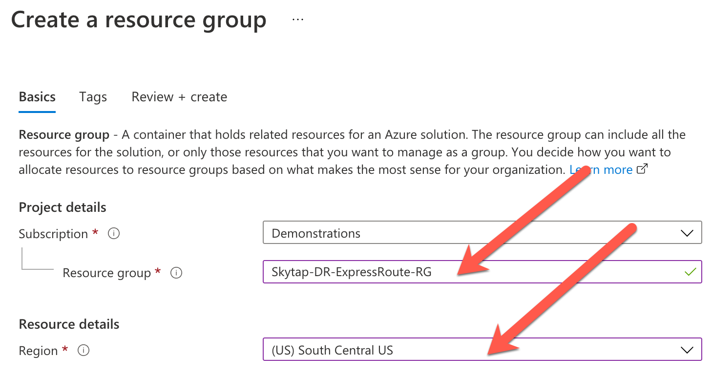
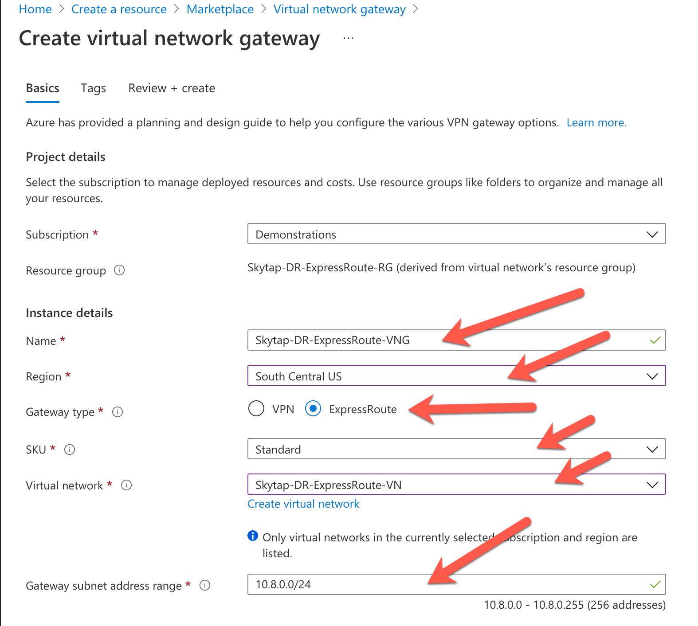
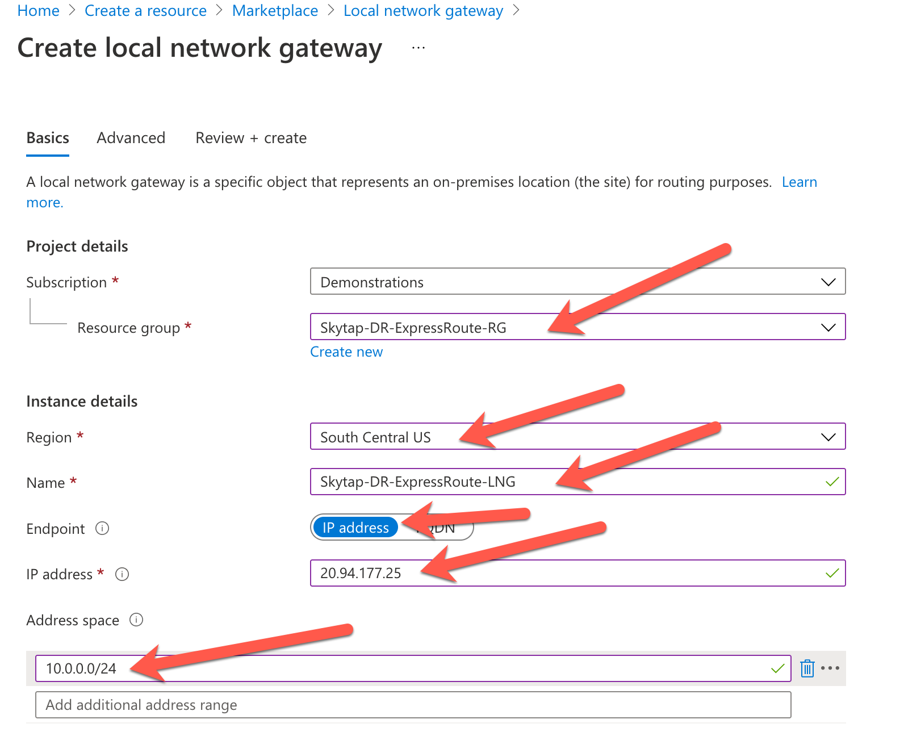
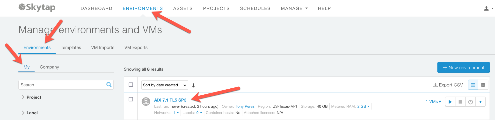

---Draft Version: 11.28.21 \#1

=====================================================

EXPRESS ROUTE Inter-Connect from Skytap to Azure Native

**[TASK \#1: Create Skytap Environment]{.underline}**

Create the initial Skytap environment that contains your VMs or LPARs.

Login to the Azure portal and access your Skytap subscription. You
should land on the Dashboard page of Skytap.

{width="5.83125in" height="0.7008716097987752in"}

{width="6.5in" height="3.5in"}

Select \"AIX 7.1\" in the search field. Select US-Texas-M-1 as the
Region. Finally, select the AIX Template that matches your criteria.

You should see this page, make note of the default subnet that is
created, you will use that value 10.0.0.0/24 when defining your Express
Route Connection.

{width="6.5in" height="4.611111111111111in"}

**[TASK \#2: Create an Express Route Definition in Skytap]{.underline}**

Create an Express Route definition in Skytap using the following steps.

From the Manage Tab, Select \"Public IP\"

{width="5.93125in" height="1.8154943132108488in"}

Allocate a public IP address.

Note: Even though the end-point for the Express Route connection is
label \"public IP\" in the user interface, the connection described in
this document does not send traffic onto the public internet, all the
traffic stays within the Azure datacenter.

Click:

{width="2.3895833333333334in" height="0.8019280402449693in"}

Select the region where the connection will be created, in this case,
Texas-M1 which is \"South Central\" in Azure.

{width="4.347916666666666in" height="2.6516043307086616in"}

The new unattached IP address will be used in defining the Azure side of
the Express Route connection.

{width="3.5145833333333334in" height="3.0616732283464567in"}

Now define a new WAN connection in the Skytap user interface.

{width="3.8895833333333334in" height="2.4746227034120736in"}

{width="2.2383956692913385in" height="0.47049103237095363in"}

Fill in the page and press \"Save\".

{width="6.5in" height="5.236111111111111in"}

You\'ll see this message while the connection is being built:

{width="4.38125in" height="0.47042213473315836in"}

Once finished, you\'ll see the service keys required to define the
Express Route endpoint on the Azure Native side of the connection.

{width="6.5in" height="2.0972222222222223in"}

If you know what subnet(s) that will be accessed in native Azure, you
can add them now or later. The subnet 10.1.77.0/24 is what will be
defined as the VNET in Azure that the Skytap environment will talk to.

Add the remote subnet on the right side of the page.

{width="4.089583333333334in" height="0.94375in"}

**[TASK \#3: Create a Resource Group in the Azure Portal]{.underline}**

From the Azure Portal, create a Resource Group:

{width="6.5in" height="3.375in"}

Give the Resource Group a name: \"Skytap DR ExpressRoute-RG\"

{width="6.5in" height="3.4305555555555554in"}

\"South Central\" = Texas

Click \"Review & create\" and then \"Create\" to finish creating the
Resource Group.

**[Task \#4: Create a Virtual Network to attach the Express
Route]{.underline}**

{width="6.5in" height="2.0in"}

{width="6.5in" height="4.027777777777778in"}

Click: Go to Resource

{width="1.4322922134733158in" height="0.586240157480315in"}

[**TASK \#5: Create an address space and subnet**\
]{.underline}
{width="6.5in" height="1.75in"}

Create an address space: \"10.1.0.0/16\"

*If there are any other address spaces already defined, delete them. See
example, remove 10.8.0.0/16 if it exists.*

Now create a subnet 10.1.77.0/24 in the 10.1.0.0/16 address space:

{width="3.379786745406824in" height="3.7270833333333333in"}

[\
]{.underline}Create a subnet called: \"Skytap-DR-ExpressRoute-SN\"

{width="3.28125in" height="4.4675481189851265in"}

You should have 1 subnet defined:

{width="4.70625in" height="2.383292869641295in"}

**[Task \#6: Create a Virtual Network Gateway]{.underline}**

{width="5.064583333333333in" height="1.4852865266841644in"}

Create a virtual network gateway called: Skytap-DR-ExpressRoute-VNG

**\*\*\* NOTE:** The virtual network gateway creates an IP endpoint that
the Azure user interface calls \"Public IP Address\". The Express Route
connection created in this example **[\"does not\"]{.underline}** send
traffic to the public internet. All the traffic stays within the Azure
Datacenter.

{width="4.839583333333334in" height="4.343216316710412in"}

{width="6.5in" height="2.0416666666666665in"}

Click \"Review + create\"

This Azure process can take 30+ minutes to complete....

Once done, click \"Go to Resource\"

{width="1.4479166666666667in" height="0.5911614173228347in"}

Review the values of your definition.

**[Task \#7: Create Local Network Gateway]{.underline}**

Define and create a Local Network Gateway.

{width="4.597916666666666in" height="1.1273742344706912in"}

Fill out the values based on what has been defined so far:

{width="5.372916666666667in" height="4.37410542432196in"}

20.94.177.25 is the IP endpoint defined for the Skytap side of the
Express Route Connection.

10.0.0.0/24 is the address space used by the Skytap environment that we
defined.

Click \"Review and create\" and create the Local Network Gateway.

The deployment in Azure takes a few minutes.

Click on \"Go to Resource\" to review your connection configuration.

{width="1.4479166666666667in" height="0.5911614173228347in"}

**[Task \#8: Add all components to the Virtual Network
Gateway]{.underline}**

Search for your previously defined VNG called:\
\"Skytap-DR-ExpressRoute-VNG\"

Click \"Connections\"

Click \"+Add\"

{width="6.5in" height="3.5833333333333335in"}

Define the new connection inside the VNG:

{width="3.716165791776028in" height="7.70625in"}

Authorization Key = The \"Authorization Key\" shown in the WAN
definition within Skytap, see \"Task \#2\"

Peer circuit URI = The \"Resource ID\" shown in the WAN definition
within Skytap, see \"Task \#2\"

**[Task \#9: Create test VM inside of Azure Native]{.underline}**

In order to test the connection from Skytap to Azure, add a VM to the
defined subnet in the Azure VNet and attempt to \"ping\" it from the
Skytap WAN page.

Add a VM to the subnet defined in Azure.

{width="4.65625in" height="4.007061461067367in"}

Create the test VM with these values:\

{width="4.389583333333333in" height="4.635793963254593in"}

{width="5.064583333333333in" height="5.202561242344707in"}

{width="4.947916666666667in" height="5.169938757655293in"}

NOTE: Set \"Public IP\" to \"None\" if you don\'t want access to the VM
from the internet. The VM will only have a private IP visible only from
within Azure.

{width="4.900762248468942in" height="5.152083333333334in"}

{width="4.70625in" height="4.826922572178478in"}

Click \"Review + create\" to get to the final page.

Click \"Create\" to create the VM in the Azure subnet.

It takes several minutes for the VM to be created in Azure.

Once created, click \"Go to resource\" and make sure the status says
\"Running\".

On the VM details page, look for the \"Private IP Address\":

{width="4.639583333333333in" height="1.5985739282589677in"}

**[Task \#10: Test end-to-end connection from Skytap to Azure
Native]{.underline}**

In the Skytap portal, go to the WAN definition that was created:\

{width="6.5in" height="1.8888888888888888in"}

Click \"Test\" and enter the Private IP address from the Azure portal
page:

10.1.77.4

{width="4.83125in" height="4.761568241469816in"}

If everything is working, you should get \"Pass\" when pinging the Azure
VM from Skytap.

Enable the Express Route Connection in Skytap:

{width="2.50625in" height="0.7133891076115486in"}

Once enabled, you can now attach Skytap environments that includes VM
and LPARs to this Express Route Connection.

\*\*\*\*\*\*\*\*\*\*END\*\*\*\*\*\*\*\*\*\*\*\*\*\*

APPENDIX:

Connect AIX LPAR to Express Route.

Now that the Express Route Connection is working, start the AIX LPAR in
your Skytap Environment and attach the Express Route to it.

Find the original environment that you created in Skytap:

{width="6.5in" height="1.5833333333333333in"}

Once you click on it, you\'ll see this page.

Click on the \"Power On\" button to start the LPAR.

{width="2.7270297462817146in" height="6.352083333333334in"}

Once powered on, the background of the LPAR will turn \"green\", and
you\'ll see some text on the little console icon.

Click on \"Network Settings\"

{width="6.5in" height="2.361111111111111in"}

Then \"Attach to WANs\"

{width="4.919132764654418in" height="3.366375765529309in"}

Select the WAN definition that was previously created:

{width="6.5in" height="2.6666666666666665in"}

Click \"Attach\", and then \"Connect\".

Then click \"Close\".

Click \"Back\" button in the upper left corner.

{width="4.722916666666666in" height="2.217652012248469in"}

Open the AIX console.

Click on the console icon, the terminal will open.

{width="3.0729166666666665in" height="3.400924103237095in"}

The default user and password:

{width="5.18125in" height="3.694961723534558in"}

Finally ping the VM in Azure:

\# ping 10.1.77.4

{width="6.5in" height="3.0416666666666665in"}

Your Skytap AIX LPAR is now communicating with a VM in Azure Native.

\-\-\-\-\-\-\-\-\-\-\--END\-\-\-\-\-\-\-\-\--
