# Site-to-Site VPN from Skytap to Azure Native

## Table of Contents<a name="toc"></a>

* [Prerequisites](#prerequisites)
* [Configure a Public IP address in Skytap](#publicip)
* [Create a virtual network gateway in Azure](#createazurevnetgtwy)
* [Create a Local Network Gateway using the Azure Portal](#createlocalnetworkgtwy)
* [Create Site-to-Site VPN connection](#creates2sconnection)
* [Configure a Skytap VPN device](#skytapvpndevice)
* [Test connectivity](#test)
* [APPENDIX](#appendix)
  * [Connect AIX LPAR to Express Route](#connectaixviaexpressroute)

## Prerequisites<a name="prerequisites"></a>

You need the following:
 - An Azure Virtual Network with a Gateway Subnet.
 - An Skytap subscription with a Windows Server VM deployed.


###### *[Back to the Top](#toc)*
## Configure a Public IP address in Skytap<a name="publicip"></a>

We'll utilize a Windows Server VM and activate the Routing and Remote Access Service. This Windows Server VM will function as the Skytap VPN device, facilitating connectivity to the Azure Virtual Network.

Ensure you have attached a Public IP address to the Windows Server VM.

Go to the Skytap portal, then in from the top menu, select Manage, then under Connectivity, select Public IPs.

 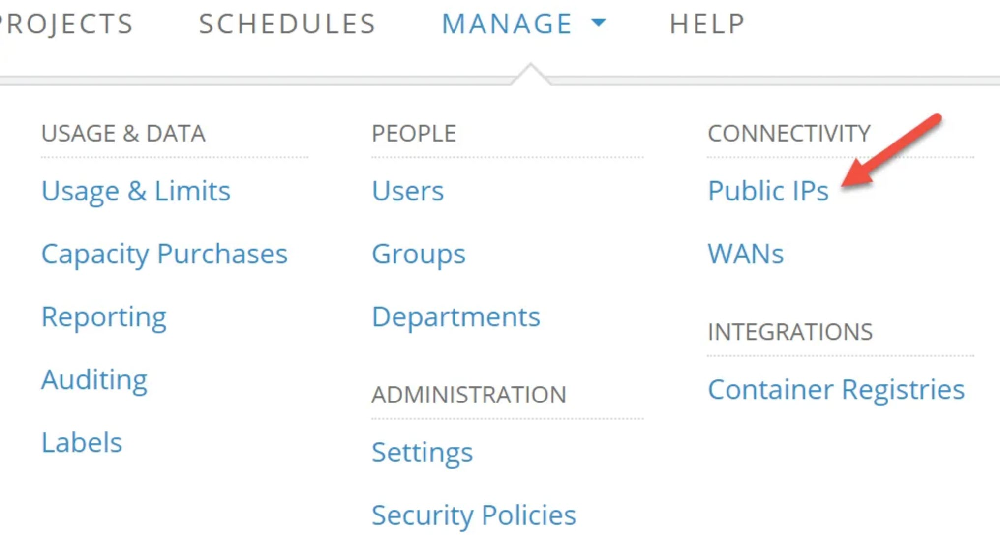

Then, request a new static Public IP address.

Once you have the Public IP address, go to the VM and associate the Public IP address to the interface under Network Settings.

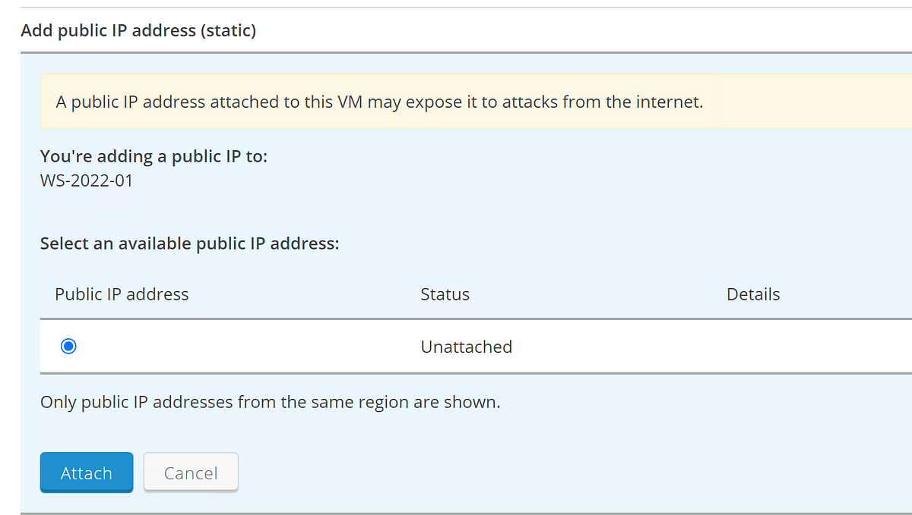

** Note down the Public IP address, as you will use it later on.

###### *[Back to the Top](#toc)*
## Create Azure Virtual Network Gateway<a name="createazurevnetgtwy"></a>


In this step, you'll create the virtual network gateway (VPN gateway) for your virtual network via the Azure Portal. Please note that creating the gateway typically requires 45 minutes or longer, depending on the selected gateway SKU.

Create a virtual network gateway by using the following values:

 - Name: skytap-vnet-gtwy
 - Region: East US
 - Gateway type: VPN
 - SKU: VpnGw2AZ
 - Generation: Generation 2
 - Virtual network: Your-Azure-Virtual-Network
 - Gateway subnet address range: Your-Azure-Gateway-Subnet-Address Range
 - Public IP address: Your-Skytap-Public-IP-Address
 - Public IP address name: Your-Public-IP-Address-Name
 - Enable active-active mode: Disabled
 - Configure BGP: Disabled

Then, select Review + create to run validation.After validation passes, select Create to deploy the VPN gateway.

 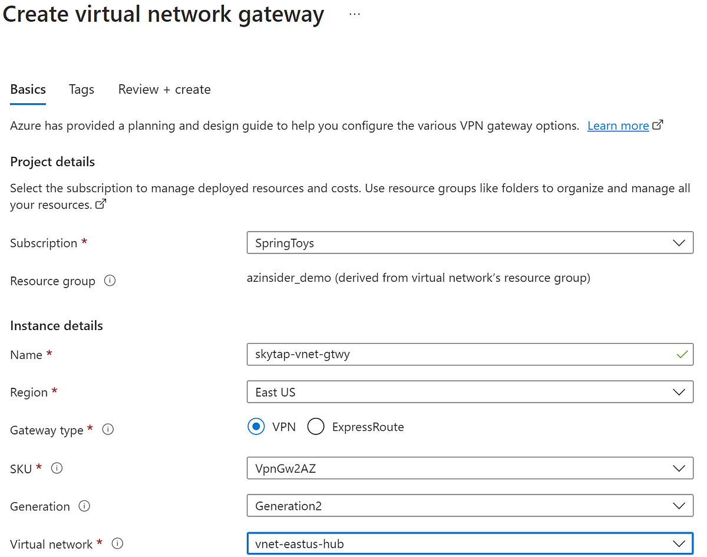


###### *[Back to the Top](#toc)*
## Create a Local Network Gateway using the Azure Portal<a name="createlocalnetworkgtwy"></a>

The local network gateway is a specific object that represents your on-premises location (the site) for routing purposes. In this case we will have the logical representation of the Skytap network.

You give the site a name by which Azure can refer to it, and then specify the IP address of the Skytap VPN device to which you create a connection. In this case, the Skytap VPN device is a Windows Server 2022 with the Routing Role configured.

In the Azure portal, in Search resources, enter local network gateway.

On the Create local network gateway page, on the Basics tab, specify the values for your local network gateway. 

Note that the IP address field should be the Public IP address from Skytap.

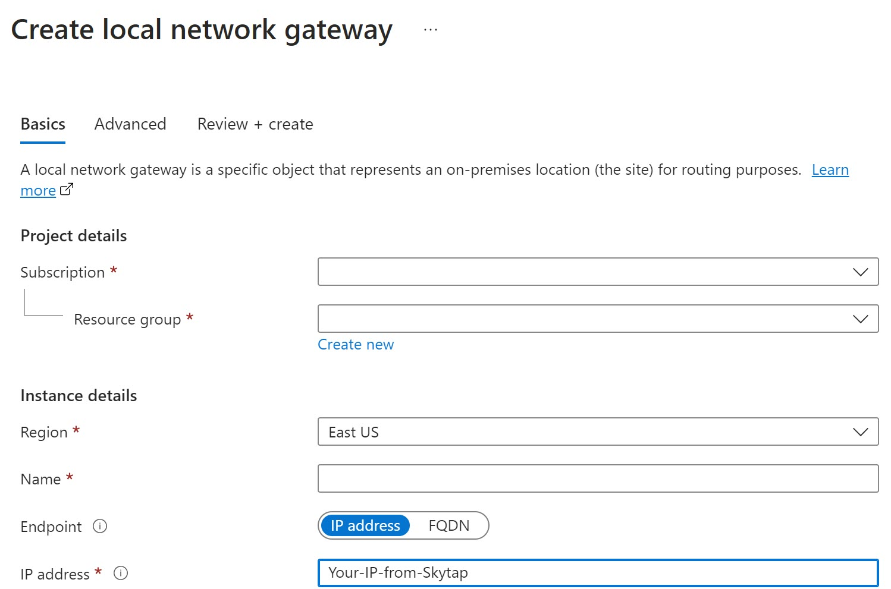


Once the deployment is complete, let’s create the Site-to-Site connection.


###### *[Back to the Top](#toc)*
## Create a Site-to-Site VPN connection <a name="creates2sconnection"></a>

Create a site-to-site VPN connection between your virtual network gateway and your Skytap VPN device.

Create a connection by using the following values:

- Local network gateway name: local-net-gtwy
- Connection name: skytap-s2s-connection
- Shared key: For this example, you use Skytap123. But you can use whatever is compatible with your Skytap VPN device. The important thing is that the values match on both sides of the connection.

On your virtual network page, on the left, select Connected devices. Locate your VPN gateway and select it to open it.

Then, on the page for the gateway, select Connections.

At the top of the Connections page, select + Add to open the Create connection page.

###### *[Back to the Top](#toc)*
## Create a Skytap VPN Device<a name="skytapvpndevice"></a>

The next step is to configure the connection to Skytap. First, we need to deploy a Windows Server VM on Skytap and attach a Public IP Address. We will use the Windows Server 2022 Datacenter image available in Skytap.

In your Skytap environment, you can add a new virtual machine. Under templates, you can look for Windows Server 2022 and then select the image to deploy, as shown below:

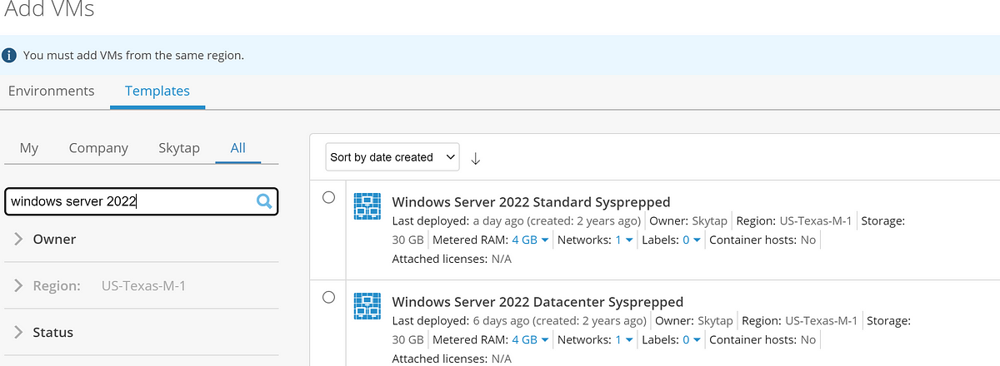

The next step is to enable the routing role. Access the VM.

Then, go to Server Manager and enable the Remote Access role as shown below:

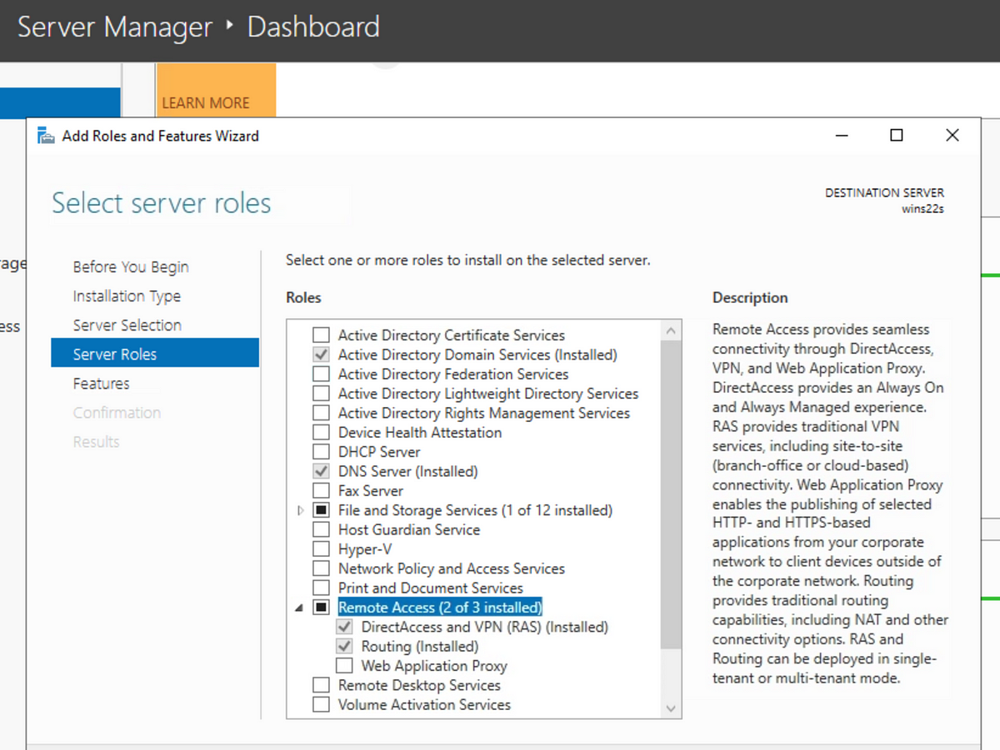

Once the Remote Access role is enabled, go to Tools, then select the Routing and Remote Access option:

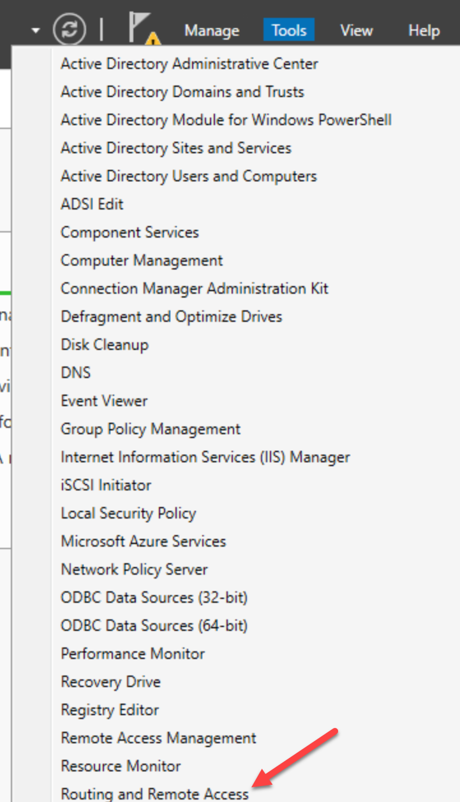

This will take you to the Routing and Remote Access section. Then right-click on the Win22S and select the option ‘Configure and Enable Routing and Remote Access’:

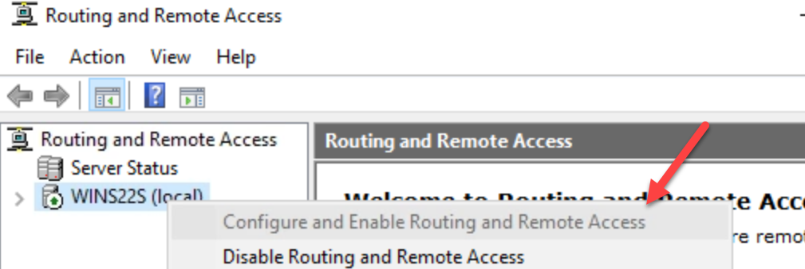

Then select Next, select the option ‘Secure Connections between two private networks’ and enable demand-dial connections to access remote networks.

We will create a new connection once the Remote Access Management service starts. You will see the ‘Demand-Dial Interface Wizard’, provide a name for the connection. Next, for the connection type, select VPN. Then, for the VPN type, select the IKEv2 option.

Then, we need to provide the ‘Destination Address.’ In this section, provide the Public IP address from the Azure VNet Gateway.

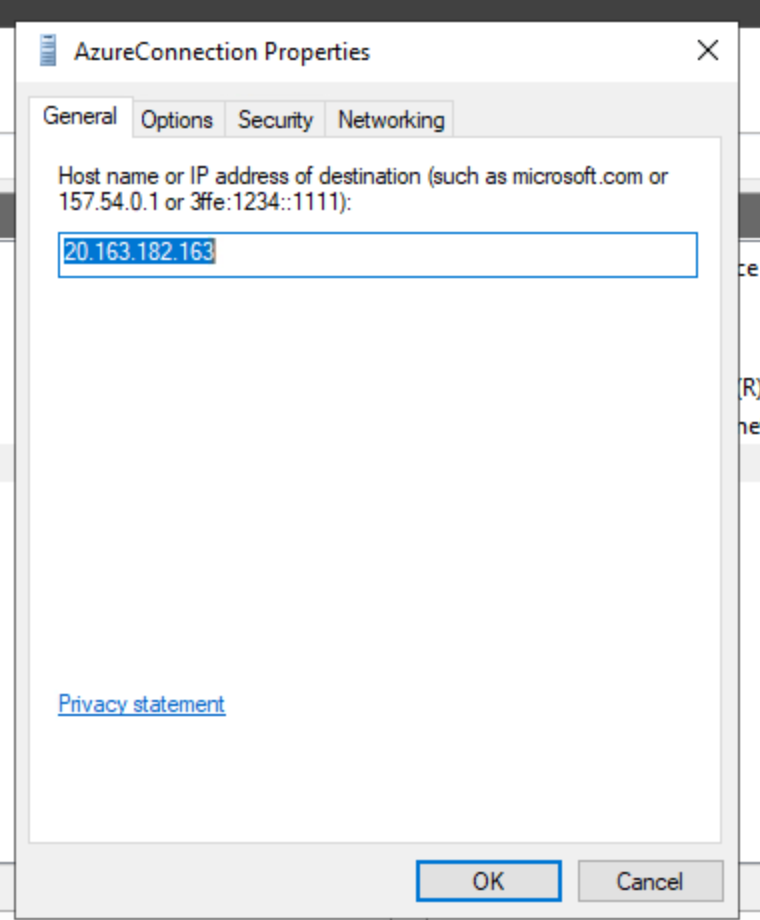

Next, under ‘Protocols and Security’ select the option ‘Route IP packets on this interface’.

Next, we will add a static route. Select the ‘Add’ option and then select the ‘Remote Network Support using IPv4’ option. Then, under destination, provide the address space from the Azure Hub Vnet. Then, the network mask will be 255.255.0.0, and ‘Metric’ equals 10.

Once we complete this setup, under the ‘IPv4’ section, go to ‘Static Routes’, right-click, and add a new static route. Now, provide the same parameters as before for the destination and mask.

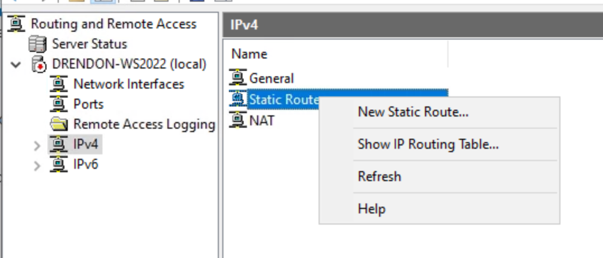

Lastly, in the same ‘Routing and Remote Access’ menu, under WinS22, select ‘Network Interfaces,’ you should see the new connection created.

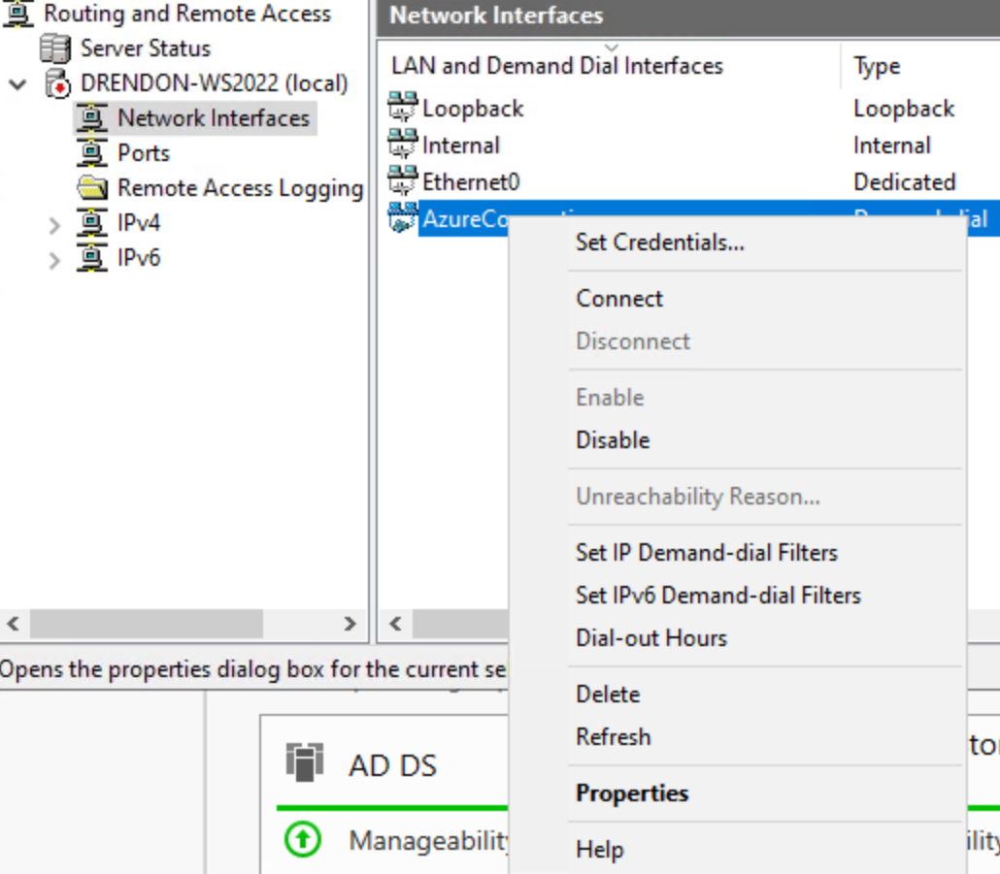

Then check on the properties, and under ‘Options-Connection Type’, make sure that the ‘Demand-dial’ option is set to never.

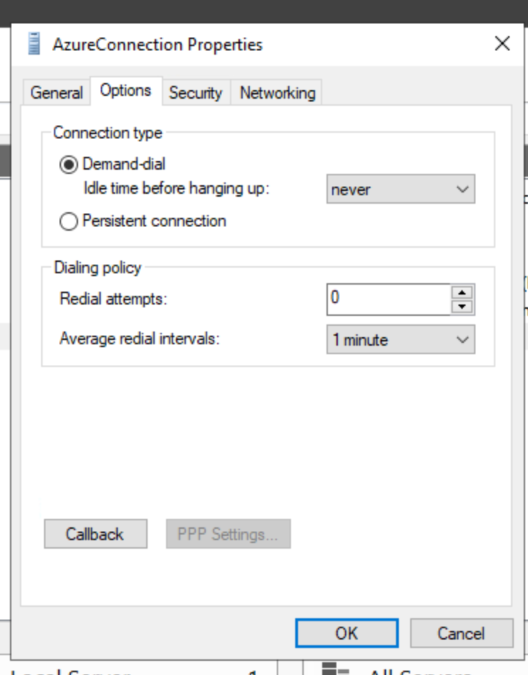

Then, under the Security tab, ensure you have the ‘Type of VPN’ set as IKEv2 and that you provide the preshared key.

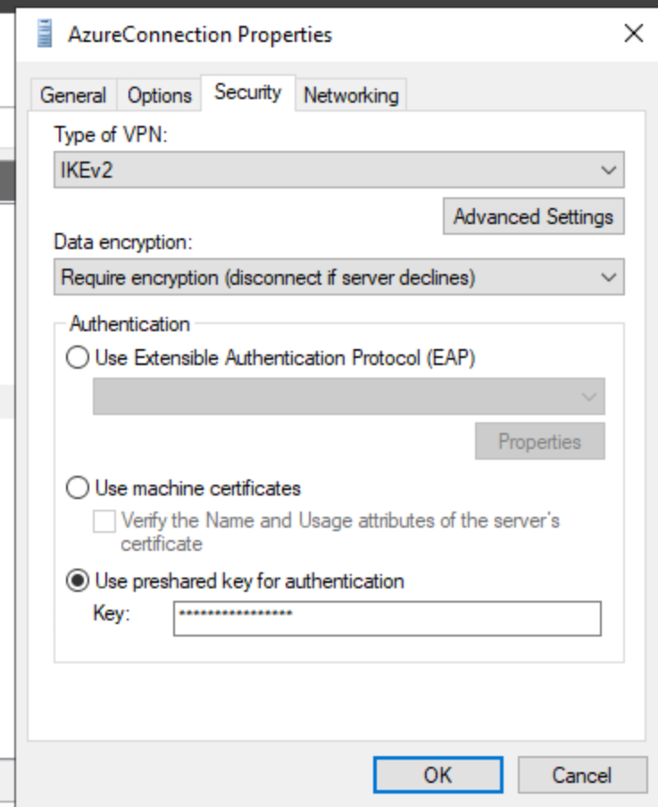

Once you complete this setup, go back to the connection and connect. After a few seconds, you should see the new status reflected.

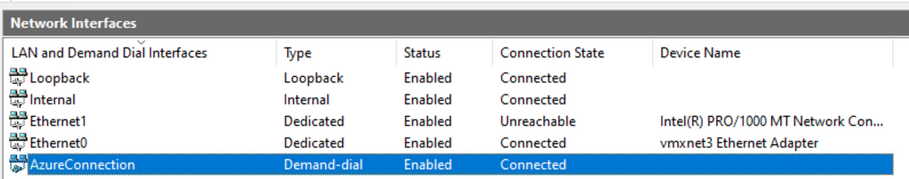

Now, we will test this configuration.


###### *[Back to the Top](#toc)*
## Test connectivity<a name="test"></a>

In order to test the connection, you can create a new Azure VM and test connectivity to a VM in Skytap.

Once you deploy the VM, access it and ping the Skytap Windows Server VM using its private IP address.


```bash
ping 10.1.0.2
```

As you can see in the below image, we can reach the Skytap VM:

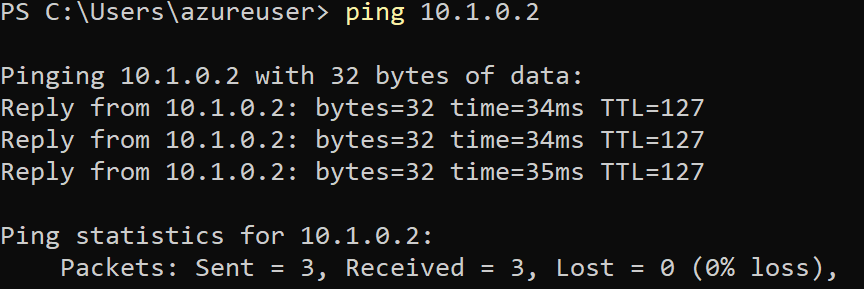


Your Skytap environment is now communicating with a VM in Azure Native.

###### *[Back to the Top](#toc)*

### Next steps

**Main Overview**
> [Skytap Well-Architected Framework]({{ site.navigation.Home }})

**Operational Excellence**
> [Skytap Operational Excellence Pillar]({{ site.navigation.Operations }})
> * [Power Discovery]({{ site.navigation.Operations }}Discovery/)
> * [Connectivity]({{ site.navigation.Operations }}connectivity/) > [Getting Started with Azure Networking]({{ site.navigation.Operations }}connectivity/azure)
> * [Connectivity]({{ site.navigation.Operations }}connectivity/) > [Getting Started with IBM Cloud Networking]({{ site.navigation.Operations }}connectivity/ibm)
> * [Ecosystems]({{ site.navigation.Operations }}ecosystems/)

**Resiliency**
> [Skytap Resiliency Pillar]({{ site.navigation.Resiliency }})<br><br>
> **Design**
> * [Design Considerations for Azure]({{ site.navigation.Resiliency }}design-considerations-azure)
> * [Design Considerations for IBM Cloud]({{ site.navigation.Resiliency }}design-considerations-ibm)

**Security**
> [Skytap Security Pillar]({{ site.navigation.Security }})
