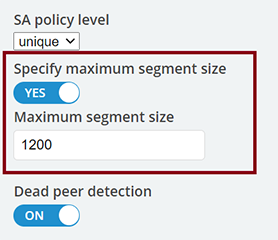

# Getting Started with Azure Networking

Even though Skytap on Azure is running within an Azure data center, Azure
treats Skytap as if it were a separate On-premises location, for network
isolation purposes. To make networking more straightforward for our
customers, Skytap and Microsoft Azure have partnered in the design of
several common network patterns, which you can put to work in your own
applications. Whether you need to connect your Skytap Environment to
your on-premises applications, or your Azure Virtual Network (VNet), or
both, there is a network topology to address your needs.

## Table of Contents 

* [Skytap on Azure Network Connectivity Considerations](#begin)
* [Option 01: Direct VPN into Skytap](#option1)
  * [Setting up a Site-to-Site VPN between On-Premises and Skytap on Azure](#site2site)
* [Option 02: VPN into Azure Hub](#option2)
  * [Setting up a Site-to-Site VPN between Skytap and your Azure VNet Gateway](#site2sitevnetgateway)
* [Option 03: Global Reach Enabled ExpressRoute](#option3)
  * [Setting up Global Reach Enabled ExpressRoute to Skytap](#expressroutewithglobalreach)
* [Appendix](#appendix)
  * [Skytap UI ports](#UIPorts)
  * [Global Reach Enabled ExpressRoute Guide](#expressroutewithglobalreachguide)
  * [Connect your Skytap application just to On-Premises, using an existing ExpressRoute to On-Premises](#expressrouteonprem)
  * [Connect your Skytap application just to an Azure Virtual Network (VNet) through an ExpressRoute](#expressroute2vnet)
  * [Connect your Skytap application to *both* On-Premises and an Azure VNet](#expressroute2vnetandonprem)
  * [Connect your Skytap application over an existing On-Premises ExpressRoute circuit, when the connection between Skytap and Azure is a VPN](#expressroute2vnetandonprem+vpn)
  * [Connect your Skytap application to *both* On-Premises and an Azure VNet, when you need transitive routing](#expressroute2vnetandonpremtransroute)

###### *[Back to the Top](#toc)*
## Skytap on Azure Network Connectivity Considerations 

* **Regions**: [Skytap Global
    Regions](https://help.skytap.com/understanding-regions.html#understanding-regions)

**NOTE**: ***Create a LOCK on the Azure resource group** that
    contains the Skytap on Azure service. This lock is may help prevent
    someone from accidentally deleting your Skytap on Azure subscription
    that resides in an Azure resource group.*

* **Satellite Centers Connectivity**:

There are two methods to connect satellite centers into Skytap
        on Azure via VPN connection:

   * **Method 1:** VPN between satellite facilities **terminating** **directly** into Skytap on Azure

   * **Method 2**: VPN connection between satellite facilities and Azure VPN Gateways in your Azure hub leveraging an Azure Virtual WAN hub or an Azure Route Server

**Best practice:** To determine latency between your connectivity into Skytap on Azure (i.e., your DC, Distribution Warehouse), we recommend conducting a [Skytap Speed Test](http://speedtest.skytap.com/).

###### *[Back to the Top](#toc)*
## Option 1: Direct VPN Connection into Skytap

For context, this methodology will leverage a direct VPN into Skytap on
Azure (bypassing the Azure hub network). While the Global Reach enabled
ExpressRoute (option 3 below) is the most robust option, consider this
direct VPN approach when the satellite facilities do not require access
to additional Azure resources.

Keep in mind that this option may have the highest latency; however, the
latency may be within the margin of successful operations. As is the
case with all options, Skytap recommends conducting a Skytap Speed Test
as mentioned above.

**Links to helpful resources:**

*[Skytap VPN
    documentation](https://help.skytap.com/wan-create-vpn.html#creating-a-vpn-connection-to-your-skytap-account)
    on how to make VPN connections into Skytap on Azure:

**Reference Architecture**

### Setting up a Site-to-Site VPN between On-Premises and Skytap on Azure

Skytap's built-in VPN service gives you a streamlined option to
establish a VPN tunnel between your environment in Skytap, and your
on-premises deployment. The tunnel is encrypted and encapsulated, routed
over the public internet.

A VPN is like a bridge: both sides must be "facing each other" for
traffic to flow. This means that each VPN endpoint must be configured
the same way, with the same parameters. Before you begin, speak to your
company's IT department to [find out which VPN
parameters](https://help.skytap.com/wan-vpn-configuration-parameters.html)
you'll need to use for Skytap\'s side of the VPN.

Also like a bridge, VPNs are most reliable when distance being spanned
is short. This means the two endpoints should be as close together as
possible. You'll want to set up the Skytap VPN endpoint in a region
which is nearest to your corporate VPN endpoint. Choose the region in
your Skytap account which is nearest to your corporate endpoint, and
[create the static public IP
address](https://help.skytap.com/managing-public-ip-addresses.html#AddingastaticpublicIPaddresstoyouraccount)
for your new VPN.

Now you're ready to create your VPN. Using the parameters you've agreed
upon with your IT department, [create the VPN endpoint in
Skytap,](https://help.skytap.com/wan-create-vpn.html) and work with your
company\'s IT department to set up a matching-configuration endpoint on
your On-Premises VPN device. Once both endpoints are set up, make sure
that you specify at least one remote subnet on the Skytap side (this is
the on-prem network subnet that Skytap will be sending to and receiving
from), and then **be sure to [test your
VPN](https://help.skytap.com/wan-testing.html#Test_the_VPN)** to confirm
that it will properly establish a tunnel.

Once you've confirmed that your VPN can successfully establish Phase1
and Phase2 connectivity, [connect your VPN to its intended the Skytap
Environment(s)](https://help.skytap.com/wan-connecting-environments-to-vpn-or-pnc.html#Connect),
choose a server from each side of the WAN topology that need to talk to
each other (one from Skytap and one from your on-premises network), and
[test the final end-to-end
connectivity](https://help.skytap.com/wan-testing.html#Further) between
each server.

###### *[Back to the Top](#toc)*
## Option 2: VPN into Azure WAN Hub

For context, the VPN into Azure Hub option may provide a lower latency
connection over Option 1 (direct VPN into Skytap) and perhaps even
Option 3 due to the specific routing of your current ExpressRoute.

In this case, you will establish VPN connections between satellite
facilities and the closest Azure VPN point-of-presence (POP) which
leverages the Azure backbone to hit your Azure hub region. Once there,
you will either leverage an [Azure VWAN
HUB](https://docs.microsoft.com/en-us/azure/virtual-wan/virtual-wan-global-transit-network-architecture)
or [Azure Route
Server](https://docs.microsoft.com/en-us/azure/route-server/overview)

Links to helpful resources:

* Specific Azure doc relevant to this option: [About Azure Route
    Server supports for ExpressRoute and Azure VPN \| Microsoft
    Docs](https://docs.microsoft.com/en-us/azure/route-server/expressroute-vpn-support#:~:text=Azure%20Route%20Server%20supports%20not%20only%20third-party%20network,peering%20between%20the%20gateway%20and%20Azure%20Route%20Server.)

* VWAN Hub info
    <https://docs.microsoft.com/en-us/azure/virtual-wan/virtual-wan-about>

**Reference Architecture**

### Setting up a Site-to-Site VPN between Skytap and your Azure VNet Gateway

Site-to-Site VPNs that connect into Azure virtual network (VNet)
Gateways are just like site-to-site VPNs that connect to on-premises
deployment: they send traffic that is both encrypted and encapsulated.
But there's also something a little different: When Skytap VPNs use
Azure's own internet routing, this means that traffic sent from Skytap
to an Azure VNet via VPN will generally remain on the Azure backbone.
This makes VPNs a relatively simple, lower cost, and behaviorally
consistent option, especially for proofs-of-concept and Dev/Test
applications.

Setting up a Site-to-Site VPN between Skytap and Azure begins by sorting
out which VPN parameters you'll need to use. When connecting a Skytap
VPN to an Azure VNet, the parameters you'll configure on Skytap's side
are going to be determined by the intersection of your IT department's
requirements, [Skytap's supported parameter
set](https://help.skytap.com/wan-vpn-configuration-parameters.html), and
[Azure's supported parameter
set](https://docs.microsoft.com/en-us/azure/vpn-gateway/vpn-gateway-about-vpn-devices#ipsec).

It's worth noting that Skytap no longer supports Azure's default IKE
Phase 1 DH (Diffie-Hellman) Group---Group 2 (1024 bit)---due to its weak
security. You'll need to [manually configure the parameters for your
Azure VPN
Gateway](https://docs.microsoft.com/en-us/azure/vpn-gateway/ipsec-ike-policy-howto#s2sconnection),
rather than accepting the default configuration provided by Azure.

Due to Maximum Transmission Unit (MTU) limits between Azure and Skytap,
you'll also need to ensure that you clamp the Skytap-side VPN MSS to
1200. (Despite its smaller packet size, Skytap has found that clamping
your maximum segment size (MSS) to 1200, rather than Azure's
standard-recommended 1350, ensures the best performance, and least
amount of packet loss when the Skytap-side of the VPN is sending data.)
It will ensure that your packets flow freely between Skytap and Azure,
rather than being dropped or bounced, which can cause your VPN traffic
to be slow, or even come to a standstill. In the Skytap portal, the
setting to clamp your VPN's MSS is at the bottom of the Edit WAN page:

Since VPNs are most reliable when distance being spanned is short, the
two endpoints should be as close together as possible. You'll want to
set up the Skytap VPN endpoint in a region which is nearest to your
existing Azure services. Choose the region in your Skytap account which
is nearest to your existing Azure VNet, and [create the static public IP
address](https://help.skytap.com/managing-public-ip-addresses.html#AddingastaticpublicIPaddresstoyouraccount)
for your new VPN.

Now you're ready to create your VPN. Using the parameters you've agreed
upon with your IT department, [create the VPN endpoint in
Skytap](https://help.skytap.com/wan-create-vpn.html). Then [configure
the VPN
Gateway](https://docs.microsoft.com/en-us/azure/vpn-gateway/ipsec-ike-policy-howto#s2s-vpn-with-ipsecike-policy)
to your Azure virtual network. Once both endpoints are set up, make sure
that you specify at least one remote subnet on the Skytap side (this is
the on-prem network subnet that Skytap will be sending to and receiving
from), and then **be sure to [test your
VPN](https://help.skytap.com/wan-testing.html#Test_the_VPN)** to confirm
that it will properly establish a tunnel.

Once you've confirmed that your VPN can successfully establish Phase1
and Phase2 connectivity, [connect your VPN to its intended the Skytap
Environment(s)](https://help.skytap.com/wan-connecting-environments-to-vpn-or-pnc.html#Connect),
choose a server from each side of the WAN topology that needs to talk to
each other (one from Skytap and one from your on-premises network), and
[test the final end-to-end
connectivity](https://help.skytap.com/wan-testing.html#Further) between
each server.

###### *[Back to the Top](#toc)*
## Option 3: Global Reach Enabled ExpressRoute

This is the recommended robust connection path for performance-sensitive
workloads connecting directly between Skytap to On-Prem. Keep in mind,
you will need to consider your existing ExpressRoute configuration and
latency between the endpoints.

This approach will give you transitive routing between on-premises and
Skytap-on-Azure. To set this up, create a new Azure Backbone
ExpressRoute connection (see architecture below) between the Skytap on
Azure service in Azure US East and your Azure hub. Note that the
backbone ExpressRoute is not a new MPLS ExR circuit; rather, it's a
native Azure ExR configured in the Portal that does not require you to
engage a Telco provider. Once configured in the Azure Portal, Microsoft
will create this connection on the backend (may take 20-30 mins. to
propagate). Once the Backbone ExpressRoute is established between Skytap
and your Azure hub, you will enable Global Reach to allow transitive
routing between both ExpressRoutes.

### Setting up Global Reach Enabled ExpressRoute to Skytap

**Pre-requisites -- Global Reach Enabled ExpressRoute**

* Azure administrative rights to create the Azure resources:

    * "Back Bone" ExpressRoute. This is not a Telco ExpressRoute
        (Step 1)

    * Global Reach (Step 3)

* /29 IP address space -- for Global Reach (Step 3 below)

* Any specific application ports that need to traverse your
    on-premises firewall.

    * The ExpressRoute connection into the Skytap service is not
        firewalled, so all ports are open; however, it is a private
        connection in your network.

    * The Skytap UI does have standard ports it uses for access as
        detailed in the Appendix. Note: Some public IP addresses are
        dependent on the region deployed. The IP's listed in the
        Appendix are based on the intended region for deployment.

**Recommend Path**

The recommended path to connect Skytap on Azure to on-premises and Azure
resources is a customer-managed ExpressRoute from Skytap that has Global
Reach enabled to allow network transit from Skytap to on-prem.

* Step 1: Create the Azure circuit that your Sktyap Customer-Managed
    ExpressRoute will go through

    * [Creating a customer-managed ExpressRoute circuit for a Private
        Network
        Connection](https://help.skytap.com/wan-create-self-managed-expressroute.html#creating-a-customer-managed-expressroute-circuit-for-a-private-network-connection)

* Step 2: Create the WAN connection in Skytap-on-Azure

    * [Creating and editing a Private Network Connection with
        ExpressRoute for your Skytap
        account](https://help.skytap.com/wan-create-expressroute.html)

    * Be sure to select "Customer-managed circuit" when creating your
        Skytap WAN per the instructions above

   * Enter the service key from Step 1, where you created the
        ExpressRoute circuit in Azure

    * On the WAN Details page for your new circuit, enter the remote
        subnet of the on-premises network which your existing
        on-premises ER circuit connects to

    * Wait to enable the WAN in Skytap until the "pending"
        notification is no longer there and you have completed the
        Global Reach steps below

* Step 3: Peer your new ExpressRoute circuit with your existing
    on-premises circuit using Global Reach

    * [Azure ExpressRoute: Configure Global Reach using the Azure
        portal \| Microsoft
        Docs](https://nam06.safelinks.protection.outlook.com/?url=https%3A%2F%2Fdocs.microsoft.com%2Fen-us%2Fazure%2Fexpressroute%2Fexpressroute-howto-set-global-reach-portal&data=04%7C01%7Cb-jeffrylane%40microsoft.com%7Cec5729a0938749d66ab108d9a2d2f409%7C72f988bf86f141af91ab2d7cd011db47%7C1%7C0%7C637719849195262977%7CUnknown%7CTWFpbGZsb3d8eyJWIjoiMC4wLjAwMDAiLCJQIjoiV2luMzIiLCJBTiI6Ik1haWwiLCJXVCI6Mn0%3D%7C1000&sdata=GsFcP53iCEDjTyZNTbZoOnn0u2D7lsOMBsq6GtLQ2wI%3D&reserved=0)

    * Please note that Step 3 in the Global Reach setup requires a /29
        IP address space from your network team that does not overlap
        with any other on-prem or Azure networks you have deployed.

    * Be sure to notify your security / firewall team of the
        application ports that need to traverse the connection from
        Skytap on Azure to on-prem and back

* Step 5: Enable the WAN in Skytap

    * Step 16 of - [Creating and editing a Private Network Connection
        with ExpressRoute for your Skytap
        account](https://help.skytap.com/wan-create-expressroute.html)

* Step 6: Attach the WAN to your [Skytap
    Environment](https://help.skytap.com/creating-an-environment.html#creating-an-environment)

    * [Connecting an environment network to a VPN or Private Network
        Connection](https://help.skytap.com/wan-connecting-environments-to-vpn-or-pnc.html#additional-information)

    * Please note, there must be at least one running VM and/or LPAR
        in the environment and on the network for the connection to
        start

* Step 7: Test your connection from the VM or LPAR in Skytap to an
    on-prem system within the remote networks set on the WAN during Step
    2

    * A simple ping test to be sure the connection flows all the way
        through

**Reference Architecture Global Reach Enabled ExpressRoute**

## Appendix 

**Skytap UI ports:** 

* [**IP addresses and port ranges for
Skytap**](https://help.skytap.com/faq-ip-addresses-and-port-ranges.html#what-ip-addresses-and-port-ranges-does-skytap-use)

## [ExpressRoute and Global Reach](ExpressRoute/skytap2azureexpressroute.md)

While VPNs are a solid and commonplace solution to traffic isolation and
encapsulation, they do suffer from the "vagaries" of the public
internet: At any time, new routing hubs can come online, BGP paths can
change, and variable internet traffic congestion can impact or even
degrade your application's throughput. For performance-sensitive
workloads, Azure and Skytap recommend [Azure
ExpressRoute](https://docs.microsoft.com/en-in/azure/expressroute/expressroute-introduction),
a private network connection service which can be configured between
your on-premises site and Azure, Skytap and Azure, or both.

[Creating ExpressRoutes with
Skytap](https://help.skytap.com/wan-expressroute-overview.html) is a
fairly simple process. ExpressRoutes created by Skytap are all
configured as 1Gbps, using the Standard SKU. Alternatively, you can
[create an ExpressRoute in Azure using the set of parameters Skytap
supports](https://help.skytap.com/wan-create-self-managed-expressroute.html),
and connect it to Skytap. This is ideal when you want to create an
ExpressRoute with a Premium SKU, or with Global Reach, which aren't
supported through ERs created by Skytap.

What kind of ExpressRoute circuit(s) you'll need, and how they'll be
connected to other parts of your WAN, will depend on where your traffic
needs to go. In each of the following topologies, whether you need a
'Standard' or 'Premium' ExpressRoute depends on whether your source and
target locations are in the [same geopolitical
region](https://docs.microsoft.com/en-us/azure/expressroute/expressroute-locations#locations).

## To connect your Skytap application just to On-Premises, using an existing ExpressRoute to On-Premises

To connect your application in Skytap to On-Premises, when you already
have an ExpressRoute between Skytap and Azure, follow: **Option #3: Global Reach Enabled ExpressRoute**

### To connect your Skytap application just to an Azure Virtual Network (VNet) through an ExpressRoute 

[Walk through Skytap's help
documentation](https://help.skytap.com/wan-expressroute-overview.html)
to follow the 3 major steps of connecting your Skytap application to
your VNet: Create the ER, Configure a VNet Gateway, and Connect the
circuit. An even more detailed walkthrough can be found here.
* [Skytap on Azure - ExpressRoute Configuration](ExpressRoute/skytap2azureexpressroute.md)

### To connect your Skytap application to *both* On-Premises and an Azure VNet 

The two network topologies described above can also happily co-exist:
you can connect the same ExpressRoute circuit from Skytap in the first
case to the VNet Gateway in the second case.

There's one important caveat for this topology: any traffic sent through
the VNet Gateway *won't transit to On-Prem*, even if the On-Prem
ExpressRoute circuit is also connected to that same VNet. So if, for
example, you need your application to traffic to flow to services on
Azure, such as a firewall, an Azure VM, or other SaaS offering, before
it moves out to On-Premises, you'll need transitive routing. To set up
transitive routing, follow the steps in Example 5.

### To connect your Skytap application over an existing On-Premises ExpressRoute circuit, when the connection between Skytap and Azure is a VPN  

VPNs between Skytap and Azure are a cost-efficient, low-friction way to
allow traffic to transmit encrypted, encapsulated, and generally all
within Azure's own backbone. If you want to connect a VPN from Skytap to
an existing ExpressRoute circuit to your On-Premises site, according to
[Azure's
documentation](https://docs.microsoft.com/en-us/azure/expressroute/expressroute-howto-coexist-resource-manager#to-enable-transit-routing-between-expressroute-and-azure-vpn),
this topology [requires an Azure Route
Server](https://docs.microsoft.com/en-us/azure/route-server/expressroute-vpn-support).
Microsoft's new Azure Route Server service allows network virtual
appliances (NVAs) such as firewalls, ExpressRoute circuits, and VPNs, to
connect to one another, as a [high-availability managed
service](https://docs.microsoft.com/en-us/azure/route-server/overview).

Once you've created a VPN from Skytap to Azure, follow Azure's instructions to
[create a Route
Server](https://docs.microsoft.com/en-us/azure/route-server/quickstart-configure-route-server-portal)
on the VNet, and configure route exchange to your Skytap VPN and your
OnPrem ExpressRoute.

## To connect your Skytap application to *both* On-Premises and an Azure VNet, when you need transitive routing  

A common need among your applications is to send traffic out from
OnPrem, into an Azure VNet with one or more preexisting Azure SaaS
(software as a service) solutions, and then onward to a Skytap
Environment. Traffic also frequently needs to flow the other way as
well.

If the SaaS objects in Azure are VMs and NVAs (such as firewalls) on a
particular VNet, Azure Route Server is a low-friction solution, as shown
in Example 4.

If the topology you're trying to mesh is relatively simple, you can set
up the configuration yourself by [establishing the proper peering
relationships and route
tables](https://docs.microsoft.com/en-us/azure/expressroute/cross-network-connectivity#cross-connecting-vnets)
in Azure, bearing in mind that you must be careful to avoid [the
pitfalls around asymmetric
routing](https://docs.microsoft.com/en-us/azure/expressroute/expressroute-asymmetric-routing).

However, If you need to connect several (or complex topologies of)
VNets, you can\'t get the necessary ASNs, your NVAs don't support BGP,
or [Route Server won't work for you for any other
reason](https://docs.microsoft.com/en-us/azure/virtual-wan/virtual-wan-faq#how-does-virtual-wan-hub-routing-differ-from-azure-route-server-in-a-vnet),
an [Azure Virtual WAN
(vWAN)](https://docs.microsoft.com/en-us/azure/virtual-wan/virtual-wan-about)
is a full-service solution for configuring transitive connectivity
between Skytap, Azure, and OnPrem. The vWAN is a global transit network,
with regional hubs. You can use it to establish transitive routing
[between multiple
ExpressRoutes](https://docs.microsoft.com/en-us/azure/virtual-wan/virtual-wan-expressroute-portal)
(such as an On-Prem ER, through Azure, to a Skytap ER), or [between an
ExpressRoute and a
VPN](https://docs.microsoft.com/en-us/azure/virtual-wan/virtual-wan-site-to-site-portal)
(such as an OnPrem ER, through Azure, to a Skytap VPN), and through any
meshed topology of regional VNets. To allow traffic to transit two
ExpressRoutes that are both connected to your vWAN mesh, you'll need to
[peer the ER circuits with Global
Reach](https://docs.microsoft.com/en-us/azure/virtual-wan/virtual-wan-faq#how-does-the-virtual-hub-in-a-virtual-wan-select-the-best-path-for-a-route-from-multiple-hubs),
as in Example 1.

###### *[Back to the Top](#toc)*
## Next steps

**Main Overview**
> [Skytap Well-Architected Framework](../../README.md)

**Operational Excellence**
>[Skytap Operational Excellence Pillar](README.md)
>* [Power Discovery](../Discovery/README.md)
>* [Connectivity](README.md)
<!--  
> [Getting Started with IBM Cloud Networking](skytaponibmconnectivity.md)
-->

**Resiliency**
> [Skytap Resiliency Pillar](../../resiliency/README.md)

>**Design**
>* [Design Considerations for Azure](../../resiliency/designconsiderationsazure.md)
<!--
>* [Design Considerations for IBM Cloud](../../resiliency/designconsiderationsibm.md)
-->

**Security**
> [Skytap Security Pillar](../../security/README.md)
