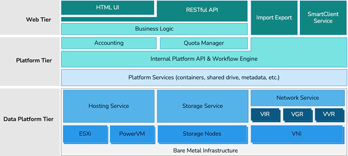
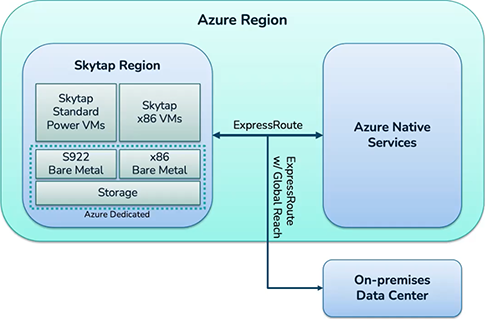
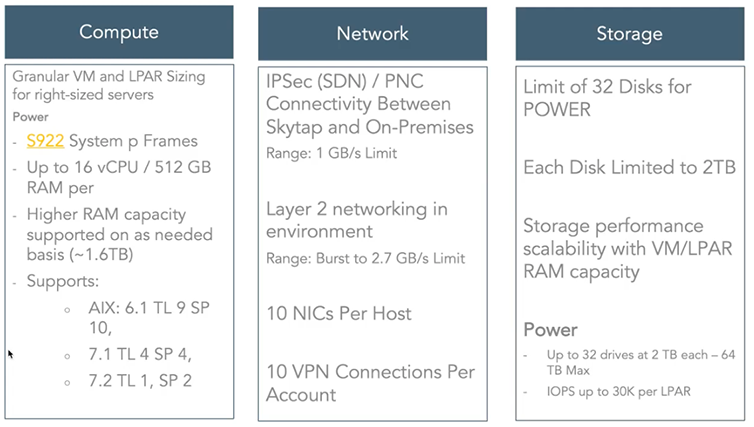

# Principles of the reliability pillar

Building a reliable application in the cloud is different from traditional application development. While historically you may have purchased levels of redundant higher-end hardware to minimize the chance of an entire application platform failing, in the cloud, we acknowledge up front that failures will happen. Instead of trying to prevent failures altogether, the goal is to minimize the effects of a single failing component.

## Considerations for Migration

The following section provides an overview of Skytap on Azure Architecture and are used as lenses to assess the reliability of an environment deployed in Skytap. 

Migration Considerations include

-   Skytap on Azure General Architecture

-   Supported LPARs

-   Warm Migration

-   Hot Migration

**Skytap on Azure General Architecture**

Here is a high-level look at the Skytap on Azure general architecture.

- **Define and test availability and recovery targets -** Availability targets, such as Service Level Agreements (SLA) and Service Level Objectives (SLO), and Recovery targets, such as Recovery Time Objectives (RTO) and Recovery Point Objectives (RPO), should be defined and tested to ensure reliability aligns with business requirements.

- **Design environments to be resistant to failures -** Resilient environment architectures should be designed to recover gracefully from failures in alignment with defined reliability targets.

- **Ensure required capacity and services are available in targeted regions -** Azure services and capacity can vary by region, so it's important to understand if targeted regions offer required capabilities.

- **Plan for disaster recovery -** Disaster recovery is the process of restoring application functionality in the wake of a catastrophic failure. It might be acceptable for some applications to be unavailable or partially available with reduced functionality for a period of time, while other applications may not be able to tolerate reduced functionality.

- **Ensure networking and connectivity meets reliability requirements -** Identifying and mitigating potential network bottle-necks or points-of-failure supports a reliable and scalable foundation over which resilient application components can communicate.

- **Allow for reliability in scalability and performance -** Resilient applications should be able to automatically scale in response to changing load to maintain application availability and meet performance requirements.

- **Address security-related risks -** Identifying and addressing security-related risks helps to minimize application downtime and data loss caused by unexpected security exposures.

**Skytap Service Layers**

Skytap is comprised of three service layer tiers as depicted below:

-   Data Platform Tier -- includes Bare Metal infrastructure, hosting
    service, storage service and network service.

-   Platform Tier -- includes business logic, accounting, quote manager,
    internal API and workflow engine and platform services (containers,
    shared drive, metadata, etc.)

-   Web Tier -- includes HTML UI, RESTful API, Import Export and
    SmartClient Service

**Skytap on Azure: Azure Region, Skytap Region and connection to Azure
Native Services**

Within a given Azure region, Skytap Standard Power WMs and x86 VMs and
Azure Dedicated S922 and x86 Bare Metal and Storage are connected via
ExpressRoute to Azure Native Services as depicted below.

**Skytap Discovery and Migration -- Support and Limits**

The following section outlines Skytap on Azure support and limits for
IBM i and AIX.

**Skytap on Azure Support and Limits for IBM i**

**Skytap on Azure Support and Limits for AIX**

High-Level Considerations for Migration to Skytap on Azure

Migration to Skytap on Azure can be migrated via a hot or cold/warm
migration as depicted here. 

## Definitions

**RTO**: Downtime of services, apps and infrastructure for business continuity – i.e., the amount of time it takes to get back up and running in the event of a disaster or outage.

**RPO**: Frequency of data backup – i.e., the amount of time in which data may be lost.

The two numbers above, combined with contingencies like distance, amount of data rate change and available bandwidth will determine whether to employ a High Availability Tool or a Disaster Recovery Tool.

This is VERY similar to a WARM versus HOT migration, and the same tools may be utilized.

## Next step

**Design**
>[Design Considerations for Azure](designconsiderationsazure.md)

>[Design Considerations for IBM](designconsiderationsibm.md)

**Solutions**
 >[Hot Migations (Replication Sync)](solutions/HotMigrationOverview.md)
  
 >[Cold (Warm) Migrations (Backup and Restore)](solutions/ColdMigrationsOverview.md)
