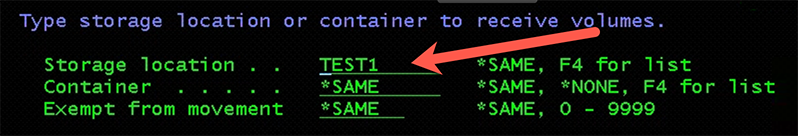

# IBM i workload migration from on-prem to Skytap using BRMS ICC

This guide is provided “as-is”. Information and views expressed in this document, including URL and other Internet Web site references, may change without notice. You bear the risk of using it.

This document does not provide you with any legal rights to any intellectual property in any product. You may copy and use this document for your internal, reference purposes.

# Table of Contents <a name="toc"></a>

* [Before you begin](#begin)
* [Key Takeaways](#takeaways)
* [Full system backup of IBM i source using BRMS ICC](#start)
* [Create ICC FTP resource](#ftpresourcecreate)


## Key Takeaways <a name="takeaways"></a>

There are 2 features for the developers and operations team to consider as key takeaways from this guide

-   Demonstrate how an IBM i workload can be migrated to Skytap on Azure using BRMS ICC. In this document you will learn how to take backup on  IBM i using BRMS ICC and transfer it to cloud using FTP.

-   Full-system recovery in Cloud using IBM i as NFS server to an IBM i
     VM as target system will also be covered in this document.

## Before you begin <a name="begin"></a>

Below LPPs need to be installed on IBM i LPAR:

-   5770-SS1 Option 18: Media and Storage Extensions

-   5770-SS1 Option 44: Encrypted Backup Enablement (Optional)

-   5770-BR1 \*BASE

-   5770-BR1 Option 1: Network feature (Optional)

-   5770-BR1 Option 2: Advanced Functions feature (Optional)

-   5733ICC \*BASE IBM Cloud Storage Solutions for i

-   5733ICC Option 1: Cloud Storage

-   5733ICC Option 2: Advanced

-   5733ICC Option 3: Reserved -- Option 3,4,5,6,7\

-   Install latest PTFs on IBM i with below individual PTFs installed

> [Minimum](https://cloud.ibm.com/docs/power-iaas?topic=power-iaas-minimum-levels)
 PTF level for IBM i

-   Utilized ASP should be less than 48% in IBM i LPAR

###### *[Back to the Top](#toc)*

# Full system backup of IBM i source using BRMS ICC <a name="start"></a>

## Create ICC FTP resource <a name="ftpresourcecreate"></a>

-   Create ICC FTP resource where IBM i backup will be transferred. FTP resource can be IBM i or Linux system.For this document, we will be using Linux in our examples.

-   In case of large data, it is recommended to use Linux system On-Prem and transfer the data to Linux system on cloud using AZ copy.

***NOTE***: *If you have 5 disk arms on-prem with xyz storage, then re-create that setup in your Skytap LPAR.*

-   Create FTP resource using below command: 
```
===\> CRTFPRICC
```
where root directory is the directory in the FTP server where we want to transfer the data and resource URI will be IP of FTP server with syntax: *< FTP server IP >: < port number >./ < root directory >*


Once completed you will see: \"Resource TEST1 was created for resource type FTP.

-   Once the resource is created, run the following command:\
```
    > ===\> INZBRM \*DATA\
```
    
Once you press \<ENTER\> wait for the command to complete, there
    is no confirmation message that is displayed. This command will
will automatically create the below control groups for the Test1
    resource created in previous step.


> QCLDBGRP01
>
> QCLDBIPL01
>
> QCLDBSYS01
>
> QCLDBUSR01\
> \
> \<NOTE: What commands will show these objects actually got created?
> Where do you look?\>

-   Put the system in restricted state using below command:

> ===\> ENDSBS \*ALL \*IMMED\
> Wait for the message: \"System ended to restricted condition.\"\
> or use command:\
> ===\> WRKSBS\
> And refresh until you see it has completed.

-   Change subsystems to process for Control Group QCLDBSYS01 using:\
    > ===\> WRKCTLGBRM\
    > and take option 9 in front of QCLDBSYS01\
    > \
    > Enter the values matching the screen below, make sure to put
    > \"\*NO\" for restart. Press \<ENTER\> once you have all the values
    > filled in. Then F3 to exit.


Change Restart to \*NO for Seq 10 Subsystem \*ALL


Start backup using below command:

> **===\> STRBKUBRM CTLGRP(QCLDBSYS01) SBMJOB(\*NO)**

-   Check for error messages once the backup is complete.\
    > \<NOTE: How do you check for errors?)\
    > \<NOTE: You will see messages like: \"1 of 120 libraries
    > processed....84 objects saved\>\
    > \<NOTE: The backup will take a while to complete....\>\
    > \<NOTE: This first backup command save USER data to virtual
    > tape.\>\
    > \<NOTE: When the processing is finished you will see a message
    > like:\
    > \"Control group QCLDBSYS01 type \*BKU processing is complete\" \>

-   Change BRMS Control Group QCLDBIPL01 using command:\
    > \
    > ===\> **WRKCTLGBRM\
    > **Select QCLDBIPL01, Select Option 8=Change attributes, Page down
    > once, change Automatically backup media information to \*LIB, also
    > Append to media to \*NO.\
    > \
    > \<NOTE: We need to explain the \"WHY\" we are changing these
    > values\>


-   Select Option 9=Subsystems to process \<NOTE: Do we stay on
    > QCLDBIPL01?\>

> Change Restart to \*YES for Seq 10 Subsystem \*ALL \<NOTE: The value
> on the screen is already \"YES\"??? Error???\>

-   Run the second backup from console:

> **===\> STRBKUBRM CTLGRP(QCLDBIPL01) SBMJOB(\*NO)\
> **\<NOTE: The second backup command saves SYSTEM DATA to optical
> media\>\
> \<NOTE: Got message \"STRTCP Started for QSECOFR....\"

Note: QCLDBIPL01 and QCLDBSYS01 control groups are used for entire
system backup, and QCLDBUSR01 and QCLDBGRP01 are used for incremental
backups.

-   Once the backups are complete check for the media using command:\
    > ===\> WRKMEDBRM.\
    > \<NOTE: What are we looking for?\>\
    > take 6 option in front of any one of them

> It will show you the medias used for backup and the order as well in
> which we need to add them in catalog in NFS server

4.  **[Transfer backup media to ICC FTP resource]{.underline}**

-   Start FTP server using command:\
    > ===\> STRTCPSVR \*FTP\
    > It may be already started, output will be: \"FTP Server Starting\"

-   Start QICC subsystem using command:\
    > ===\> STRSBS QICC/QICCSBS

-   Move the media to FTP resource using command:\
    > ===\> WRKMEDBRM\

    Find all the media objects that have the \"+\" (plus sign) next to them. They should end with \"OPT\" and \"TAP. Put an \"8\" (move)
    next to all of them with the plus sign. You might have to page
    down to find all of them. Press \<ENTER\> after putting 8 next to
     each entry.

    You should see a screen similar to this:


Change \"Storage location\" to \"TEST1\" that was created earlier:



And press \<ENTER\>


Note: QCLDBIPL01 will use virtual optical media and QCLDBSYS01 will use
virtual tape media

-   After moving the media, check the status of transfer using the below command:

>WRKSTSICC Status(\*All)

You will see the Volume Name, Status, and Complete % for each file
transfer. Wait until all Volumes have Successfully been completed to
proceed to the next step.

-   Generate BRMS recovery report using below command:

> **STRRCYBRM OPTION(\*CTLGRP) ACTION(\*REPORT) CTLGRP((QCLDBSYS01 1)
> (QCLDBIPL01 2))**

**Copy backup media from ICC FTP resource to IBM i LPAR on cloud.** 
(This step can be skipped if backup is being transferred to IBM i server in 4^th^ step)

This IBM i LPAR will be used as NFS server to build the target IBM i
LPAR

-   Create a directory in IFS where you want to copy the media from FTP
server using the below command:

 >MKDIR '/XX', where xx is the directory name
      
-   Start FTP server and QICC subsystem if not already started using
below commands:


>STRTCPSVR \*FTP

>STRSBS QICC/QICCSBS

-   Copy the media from FTP server to IBM i LPAR using the below command,
   where LOCALFILE will be the directory created in previous
    step/media volume name and CLOUDFILE will be the file name FTP
    server with syntax QBRMS\_xx.


>CPYFRMCLD RESOURCE(Test) Async(\*No) CLOUDFILE(\'QBRMS\_IBMI74/QO3911\') LOCALFILE(\"/xx/QO3911\')

**IBM i recovery from IBM i NFS server**

-   Create image catalog and add media entry to image catalog using
     below commands in IBM i NFS server:

> CRTDEVOPT DEVD(INSTALL) RSRCNAME(\*VRT)

VARY ON the Optical drive

>   CRTIMGCLG IMGCLG(XXX) DIR(\'/XX\') TYPE(\*OPT) CRTDIR(\*YES)

>   ADDIMGCLGE IMGCLG(XXX) FROMFILE('media name') TOFILE('media name')

Load image catalog to Optical drive

Verify image catalog with verify type as \*LIC and NFSSHR as \*YES

- Start the NFS server and change NFS export options using below
    commands:

>   STRNFSSVR SERVER(\*All)

>   CHGNFSEXP OPTIONS('-i -o ro') DIR('/xx)


-   Change object authorities and TFTP attributes:


> CHGAUT OBJ(\'/xx\') USER(\*PUBLIC) DTAAUT(\*RWX) SUBTREE(\*ALL)

> CHGTFTPA AUTOSTART(\*YES) ALTSRCDIR(\'/xx\')

> CHGAUT OBJ(\'/xx\') USER(QTFTP) DTAAUT(\*RX) SUBTREE(\*ALL)

-   Restart the TFTP server:

> ENDTCPSVR SERVER(\*TFTP)

> STRTCPSVR SERVER(\*TFTP)

**Configure IBM i client server (target LPAR)**

-   Login to SST and select option 8 -- Work with service tools User IDs
     and Devices

-   Press F13 and select the LAN adapter

The LAN adapter needs to be on the same VLAN as IBM i NFS server,

-   Configure service tools LAN adapter:

    -   IP version allowed = IPV4

    -   Internet address = you can use the same IP of the client
        (TARGET)

    -   Gateway router address = use the same gateway on the client

    -   Subnet mask = use the same

    -   Press F7=Store

    -   Press F13= Deactivate

    -   Press F14=Activate

-   Verify port 3000 status as active using NETSTAT \*CNN and use F14 to
    display port numbers

-   Create client server optical device

    -   CRTDEVOPT, Press F4 to prompt

    -   Local internet address = \*SRVLAN

    -   Remote internet address = the IP address of the IBM i VSI NFS
         Server

    -   Network image directory = '/xx'


-   Vary on the optical device created in previous step and verify you
    can access the remote image catalog using WRKIMGCLGE IMGCLG(\*DEV)
   DEV(Opt dev)


-   Start network install to start scratch installation starting from LIC
     installation, prior to installation make sure to document all
     current network information, same may be needed after restoration.

-   Start network install:

    -   STRNETINS press F4 to prompt

    -   Network optical device = Optical Device

    -   Installation option = \*LIC

    -   Keylock mode = MANUAL


-   On Install LIC screen, take Option 2 to Install LIC and Initialize
     system


-   Post LIC installation, do disk configuration

-   Initialize non configured disks and add to ASP

-   Install OS using below option:


-   On Install device type, Select option-2 -- Network device

-   Configure the network device:

    -   Server IP = the IP address of the SOURCE NFS IBM i VSI

    -   Path Name = the name of the Directory where the image volumes
         are located

    -   Press F10 = Continue

-   Press Enter twice to confirm and on Install the OS screen, take Install Option as 2


-   Select Option 1=Restore programs and language objects from the
     current media set

-   Select Option 2=Keep for Job and output queues

-   Select Option 1=Yes for distribute operating system and on available
     disk units

-   Change system information -- 1 to restore

-   Change following on next screen:

-   Start print writers = N

-   Start system to restricted state = Y

-   Set major system options = Y

-   Define or change system at IPL = Y

 **Set System date, time, and time zone same as current [Source
     System]**

-   Enable automatic configuration -- Y


-   Select Option 3 twice to change the following system values:


>  QALWOBJRST \_\_\_\_\_\_\_\_\_\_\_\_\_\_\_ \*ALL

>   QFRCCVNRST \_\_\_\_\_\_\_\_\_\_\_\_\_\_\_ 0

>   QINACTITV \_\_\_\_\_\_\_\_\_\_\_\_\_\_\_ \*NONE

>   QJOBMSGQFL \_\_\_\_\_\_\_\_\_\_\_\_\_\_\_ \*PRTWRAP

>   QJOBMSGQMX \_\_\_\_\_\_\_\_\_\_\_\_\_\_\_ 30 (minimum, 64
     recommended)

> QLMTDEVSSN \_\_\_\_\_\_\_\_\_\_\_\_\_\_\_ 0

>   QLMTSECOFR \_\_\_\_\_\_\_\_\_\_\_\_\_\_\_ 0

>   QMAXSIGN \_\_\_\_\_\_\_\_\_\_\_\_\_\_\_ \*NOMAX

>   QPFRADJ \_\_\_\_\_\_\_\_\_\_\_\_\_\_\_ 2

>   QPWDEXPITV \_\_\_\_\_\_\_\_\_\_\_\_\_\_\_ \*NOMAX

>   QSCANFSCTL \_\_\_\_\_\_\_\_\_\_\_\_\_\_\_ \*NOPOSTRST

>   QVFYOBJRST \_\_\_\_\_\_\_\_\_\_\_\_\_\_\_ 1


-   Press F3 twice and change the QSECOFR password. Note: the current
     QSECOFR password will be QSECOFR (capital letters)

-   Recover the BRMS libraries on target system:

-   CRTDEVOPT, Press F4

-   Local internet address = \*SRVLAN

-   Remote internet address = the ip address of the IBM i NFS Server

-   Network image directory = '/xx'

-   Vary ON the device

-   Verify you can access the image catalog:

   >   WRKIMGCLGE IMGCLG(\*DEV) DEV(INSTALL)

> CHGMSGQ MSGQ(QSYSOPR) DLVRY(\*NOTIFY) SEV(99)

-   Recover BRMS libraries, follow the BRMS recovery report (Step 004
     needs to be followed at this stage)

-   RSTLIB SAVLIB(saved-item) DEV(optical device) VOL(media name)
     OPTFILE(\'\')

-   Recover the BRMS related media information using the recovery steps
     in BRMS recovery report:


>   RSTOBJ OBJ(\*ALL) SAVLIB(saved-item) DEV(device-name) VOL(media name) OPTFILE(\'\') MBROPT(\*ALL) ALWOBJDIF(\*COMPATIBLE)


>   INZBRM OPTION(\*SETAUT)

>   SETUSRBRM USER(QSECOFR) USAGE(\*ADMIN)

>   INZBRM OPTION(\*DEVICE)

>   Verify installation device using WRKDEVBRM

>   Follow step010 in recovery report to recover user profiles

Note: TCP/IP must be started so BRMS can transfer media required by a
recovery from the cloud.

If you wish to continue the recovery in restricted state, run the
following commands:

> STRTCP STRSVR(\*NO) STRIFC(\*NO) STRPTPPRF(\*NO) STRIP6(\*YES) STRTCPIFC
INTNETADR(\'nnn.nnn.nnn.nnn\'), Where 'nnn' is IP of recovery system

Otherwise,

Start all subsystems using STRSBS QCTL, STRTCP

-   Run the following to setup Cloud volumes:

  >   CALL QBRM/Q1AOLD PARM(\'CLOUD \' \'FIXDRVOL ' \'xxxxx1\'
        > \'xxxxx2\' \'xxxxx3\' \'xxxxxn\')

 Volume names can be found from BRMS report file name QP1A2RCY

>  STRRCYBRM OPTION(\*SYSTEM) ACTION(\*RESTORE)

Note: Press F9 on the Select Recovery Items display to go to the Restore

Command Defaults display.

-   Ensure the tape device name or media library device name is correct
     for the Device prompt

-   Ensure \*SAVLIB is specified for the Restore to library prompt

-   Ensure \*SAVASP is specified for the Auxiliary storage pool prompt

-   ENSURE \*YES is specified for create parent directories

If you are recovering to a different system or a different logical
partition, you must specify the following:

-   \*ALL for the Data base member option prompt

-   \*COMPATIBLE for the Allow object differences prompt

-   \*NONE for the System resource management prompt

Press \"Enter\" to return to the Select Recovery Items display

-   Restore \*SAVSECDTA which will restore user profiles. Change QSECOFR
     password using below command:

   >   CHGUSRPRF USRPRF(QSECOFR) PASSWORD(new-password)

-   Recover configuration data(\*Savcfg) and required system libraries

-   Do network configuration and add IP in target system

-   Ping the cloud resource URI to verify a working network to cloud
     storage

-   Create Virtual tape device and Vary ON the same:

    >  CRTDEVTAP DEVD(TOR1CLDTAP) RSRCNAME(\*VRT)

-   Move the media to \*Home location

-   Recover User libraries, DLO, IFS as per the BRMS recovery report

> UPDPTFINF

>   RSTAUT \*All

>   DSPJOBLOG Output(\*Print)

-   Change the system values as required and do a Normal IPL of the
    system.

## Next step

**Overview**
>[Skytap Reliability Pillar](../../README.md)

**Design**
>[Design Considerations for Azure](../../designconsiderationsazure.md)

>[Design Considerations for IBM](../../designconsiderationsibm.md)

**Solutions**
 >[Hot Migations (Replication Sync)](../../solutions/HotMigrationOverview.md)
  
 >[Cold (Warm) Migrations (Backup and Restore)](../../solutions/ColdMigrationsOverview.md)
