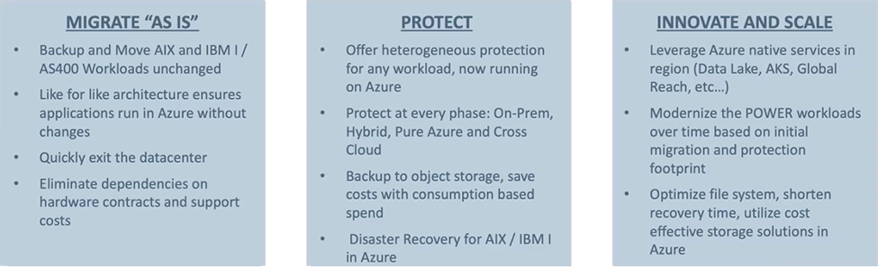

**Skytap on Azure Architecture: Skytap + Commvault**

Skytap leverages best-in-class tools to accommodate both migrations
associated with these operating systems. Skytap has an engineering
partnership with Commvault to facilitate seamless migrations. The result
is a one-touch solution to migrate your workloads into Azure.

Here is an overview of Commvault.

Here is an overview of how Skytap on Azure and Commvault work together
for AIX and IBM I (as400).

