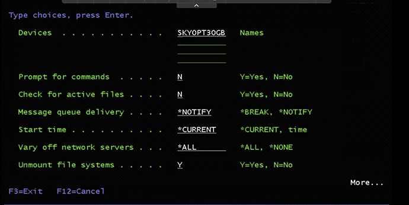
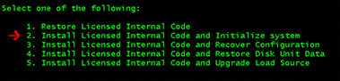

# IBM i workload migration using Go Save/Restore, Option 22-23

This guide is provided “as-is”. Information and views expressed in this document, including URL and other Internet Web site references, may change without notice. You bear the risk of using it.

This document does not provide you with any legal rights to any intellectual property in any product. You may copy and use this document for your internal, reference purposes.

## Table of Contents <a name="toc"></a>

* [Key Takeaways](#takeaways)
* [Before you begin](#begin)
* [Determining size to be backed up on ISO optical image]()
* [Create virtual optical media]()
* [Save Option 22 on optical media to create an ISO image]()
* [Save QGPL and QUSRSYS and append to existing ISO]()
* [Save Remaining data to virtual tape(s) via option 23 save]()
* [Restore Option 22 with ISO]()
* [Restore QUSRSYS and QGPL to get network]()
* [Restore remaining data via virtual tape]()


## Key Takeaways <a name="takeaways"></a>

These are some key takeaway for developers and operators to consider from this guide:

* Demonstrate how an IBM i workload can be migrated to Skytap on Azure using Go Save, Option 22,23.

* Full-system recovery including LIC, OS installation

## Before you begin <a name="begin"></a>

* Install latest PTFs on IBM i

* Utilized ASP should be less than 48% in IBM i LPAR. Amount of disk space can be reduced by doing clean up as mentioned in the link below:

  * [https://www.ibm.com/support/pages/reducing-system-asp-disk-space-dasd-storage-used](https://www.ibm.com/support/pages/reducing-system-asp-disk-space-dasd-storage-used)

* Azure storage account with blob storage container and valid SAS key

  * Create Azure storage account as required, and generate SAS token 

* AZCopy the virtual tapes from the NFS mounted directory into Azure object storage container

* Linux / Windows server in on-premise network, preferably close to IBM i server, preferably Linux with desktop environment over Windows, no specific storage/compute requirements, installation of AZcopy utility


**Determining size to be backed up on ISO optical image**

-   Go Disktasks, Option-1 to collect disk space information **OR**, same can be run using RTVDSKINF command

-   RTVDSKINF job will be submitted in WRKACTJOB, depending on the system size, command completion may vary system to system

-   Once the job completes, print information using PRTDSKINF or Go Disktasks, Option 2

-   In report type, select library

-   WRKSPLF, display PRTDSKINF report

-   Review QUSRSYS, QGPL, QSYS, LIC and IBM libraries size. Accordingly, create the optical media size

**Create virtual optical media**

[https://www.ibm.com/docs/en/i/7.2?topic=storage-setting-up-virtual-optical](https://www.ibm.com/docs/en/i/7.2?topic=storage-setting-up-virtual-optical) 

```bash
> CRTIMGCLG IMGCLG(skytap30GB) DIR(\'/skytap30GB\') 

> ADDIMGCLGE IMGCLG(skytap30GB) FROMFILE(\*NEW) TOFILE(skytap30GB.iso) IMGSIZ(30000)

> CRTDEVOPT DEVD(skyopt30gb) RSRCNAME(\*VRT)

> VRYCFG CFGOBJ(skyopt30gb) CFGTYPE(\*DEV) STATUS(\*ON)

> LODIMGCLG IMGCLG(skytap30GB) DEV(skyopt30gb)

> INZOPT NEWVOL(MYVOLUMEID) DEV(skyopt30gb) CHECK(\*NO) TEXT(DESCRIPTION)
```
 **Save, Option 22 to virtual optical media**

-   Bring system to restricted state using ENDSBS \*ALL \*IMMED

-   Go Save, Option22 and take below parameters on the command




-   Save QGPL and QUSRSYS and append to existing ISO in Optical device

-   SAVLIB, F4 to prompt: (QGPL first, then QUSRSYS)

    -   Choose Existing Optical device

    -   F10 for more options

    -   Change parameters: 

    -   Spooled file data = \*NONE, to not include output queues 

    -   Save file data = \*NO 

-   STRSBS QCTL to bring system out of restricted state

-   Create NFS export on directory where image catalog is loaded, so you can copy the ISO to a machine where it can be uploaded to Assets

-   ENDNFSSVR \*ALL

-   CHGNFSEXP OPTIONS(\'-F -O RW=,ANON=0\') DIR(\'/skytap30GB\')

-   STRNFSSVR \*ALL

-   Begin uploading the ISO to Assets --

    -   Mount NFS exported directory from IBM i server to Linux/Windows machine (INSERT EXAMPLE NFS MOUNT COMMAND HERE)

    -   Load Skytap portal in browser of desktop session on Linux/Windows machine

    -   Log into Skytap, Click on 'Assets'

    -   Upload ISO to Skytap account, select region where your LPAR(s) to be restored in Skytap will be hosted

**Create virtual tape media**

-   Create virtual tape image Catalog for Option 23 data

[https://www.ibm.com/docs/en/i/7.3?topic=tape-setting-up-virtual-storage](https://www.ibm.com/docs/en/i/7.3?topic=tape-setting-up-virtual-storage)

-   Determine tape size based on overall data size, you must pre-create each tape required for the total Option 23 save

-   Bring system to restricted state and start Go SAVE, Option23

-   Set up NFS exports for AZCopy Linux server to Azure

    -   ENDNFSSVR \*ALL

    -   CHGNFSEXP OPTIONS(\'-F -O RW=,ANON=0\') DIR(\'/directoryWhereTapeImageCatalogIsLocated\')

    -   STRNFSSVR \*ALL

-   Mount NFS directory above to Linux server in same network as source IBM i LPAR

Example:
```bash
mount -o nfsvers=3 10.0.0.1:/scratchASP/vtapes/home/skytap/scratchasp
```

-   Install AZCopy utility as required download here:[https://docs.microsoft.com/en-us/azure/storage/common/storage-use-azcopy-v10](https://docs.microsoft.com/en-us/azure/storage/common/storage-use-azcopy-v10)

  -  extract AZCopy archive to directory

Example:
```bash
tar -xvf azcopy\_linux\_amd64\_10.12.2.tar.gz
```

 -   Copy save files from NFS mounted location to Azure blob storage container

   [https://docs.microsoft.com/en-us/azure/storage/common/storage-use-azcopy-blobs-upload?toc=/azure/storage/blobs/toc.json\#upload-a-directory](https://docs.microsoft.com/en-us/azure/storage/common/storage-use-azcopy-blobs-upload?toc=/azure/storage/blobs/toc.json\#upload-a-directory)

Example:
```bash
azcopy copy \'\<local-directory-path-of-NFS-mount\>\' \'https://\<storage-account-name\>.\<blob or dfs\>.core.windows.net/\<container-name\>\' \--recursive
```

Example:
```bash
./azcopy copy '/home/LinuxUser/localNFSDirectory'https://<myStorageAccount>.blob.core.windows.net/containerName?\<SAS-Key>\ \--recursive
 ```

 **Deploy IBM i in Skytap cloud**

-   Deploy IBM i from template

-   Delete load source drive from hardware settings in Skytap GUI

-   Add new disk(s) for System ASP

-   Set boot mode to D Manual mode in hardware settings

-   Boot LPAR from Skytap UI and wait to reach C200 4130 boot code (No Load source Found)

-   Click button in UI to mount Option 22 ISO from Assets to LPAR

-   On Install LIC screen, take Option 2 to Install LIC and Initialize system



-   Post LIC installation, do disk configuration

-   Initialize non configured disks and add to ASP

-   Install OS using below option:


-   Enable automatic configuration -- Y on set major system option screen.


-   Change following on next screen:

-   Start print writers = N

-   Start system to restricted state = Y

-   Set major system options = Y

-   Define or change system at IPL = Y

-   Select Option 3 twice to change the following system values:

-   QALWOBJRST \_\_\_\_\_\_\_\_\_\_\_\_\_\_\_ \*ALL

-   QFRCCVNRST \_\_\_\_\_\_\_\_\_\_\_\_\_\_\_ 0

-   QINACTITV \_\_\_\_\_\_\_\_\_\_\_\_\_\_\_ \*NONE

-   QJOBMSGQFL \_\_\_\_\_\_\_\_\_\_\_\_\_\_\_ \*PRTWRAP

-   QJOBMSGQMX \_\_\_\_\_\_\_\_\_\_\_\_\_\_\_ 30 (minimum, 64 recommended)

-   QLMTDEVSSN \_\_\_\_\_\_\_\_\_\_\_\_\_\_\_ 0

-   QLMTSECOFR \_\_\_\_\_\_\_\_\_\_\_\_\_\_\_ 0

-   QMAXSIGN \_\_\_\_\_\_\_\_\_\_\_\_\_\_\_ \*NOMAX

-   QPFRADJ \_\_\_\_\_\_\_\_\_\_\_\_\_\_\_ 2

-   QPWDEXPITV \_\_\_\_\_\_\_\_\_\_\_\_\_\_\_ \*NOMAX

-   QSCANFSCTL \_\_\_\_\_\_\_\_\_\_\_\_\_\_\_ \*NOPOSTRST

-   QVFYOBJRST \_\_\_\_\_\_\_\_\_\_\_\_\_\_\_ 1

-   Press F3 twice and change the QSECOFR password. Note: the current QSECOFR password will be QSECOFR (capital letters)

-   Restore QGPL and QUSRSYS

    -   RSTLIB, F4 to prompt

    -   Select QGPL and QUSRSYS

    -   Select existing optical Device

    -   Select ALWOBJDIF as \*All and MBROPT as \*All

**Network configuration**

-   WRKHDWRSC \*CMN, check resource name of ethernet port

-   Delete existing Ethline

-   Create new Ethline

-   Configure default route and DNS

-   IPL the LPAR in normal mode

**Go Restore, Option 23**

-   Create NFS export directory on scratch ASP

-   ENDNFSSVR \*ALL

-   CHGNFSEXP OPTIONS(\'-F -O RW=,ANON=0\') DIR(\'/directoryWhereScratchASPisMounted\')

-   STRNFSSVR \*ALL

-   Deploy Centos Desktop Machine from Template into Environment


-   Boot and configure root and secondary users in CentOS

-   Mount NFS directory from IBMi server in Skytap on Linux machine:
```bash
mount -o nfsvers=3 10.0.0.1:/scratchASP/vtapes/home/skytap/scratchasp
```
-   Install AZCopy utility, download here:

[https://docs.microsoft.com/en-us/azure/storage/common/storage-use-azcopy-v10](https://docs.microsoft.com/en-us/azure/storage/common/storage-use-azcopy-v10)

   -   extract AZCopy archive to directory

Example:
```bash
tar -xvf azcopy\_linux\_amd64\_10.12.2.tar.gz
```
2.  Copy save files from Azure blob storage container to mounted NFS export directory on target IBMi server in Skytap

[https://docs.microsoft.com/en-us/azure/storage/common/storage-use-azcopy-blobs-upload?toc=/azure/storage/blobs/toc.json\#upload-a-directory](https://docs.microsoft.com/en-us/azure/storage/common/storage-use-azcopy-blobs-upload?toc=/azure/storage/blobs/toc.json\#upload-a-directory)

3.  azcopy copy \'https://\<storage-account-name\>.\<blob or dfs\>.core.windows.net/\<container-name\>/  \<directory-path\>\'\'\<local-directory-path\>\' \--recursive

4.  ./azcopy copy https://\<myStorageAccount>\.blob.core.windows.net/containerName?\<SAS-Key\>'/home/LinuxUserinSkytapCentos/localNFSDirectory'\ --recursive

-   Create virtual tape image catalog in /scratchASP/vtapes

-   Add virtual tape(s) to image catalog in directory above

-   GO Restore Option 23 from virtual tape image catalog above

 

APPENDIX:

}

Example commands:

```bash
mkdir /mydir
```

```bash
sudo 
``` 
or 
```bash 
su
```
to elevate the user to root.

```bash 
mount -o nfsvers=3 10.0.0.1:/scratchASP/vtapes/home/skytap/scratchasp
```

You can check to see the directory is exported with this command if the mount is not successful:

```bash 
showmount -e 10.0.0.1 (IP address for IBMi LPAR)
```

Create virtual tape image catalog

-   Run AZCopy to copy virtualtape(s) from Azure storage to the NFS mount

    -   Examples here:
        > [[https://docs.microsoft.com/en-us/azure/storage/common/storage-use-azcopy-blobs-download]{.underline}](https://docs.microsoft.com/en-us/azure/storage/common/storage-use-azcopy-blobs-download)
        >  

-   Go Restore, Option 23

-   Choose virtual tape device, and other parameters as below:


-   Check for joblog once the restore is completed using DSPJOBLOG

-   Save the joblog using DSPJOBLOG Output(\*Print)

-   Restore any not saved object

-   Data Restoration is complete at this point

-   Check PTF status and change the system values as required

## Next Steps

**Main Overview**
> [Skytap Well-Architected Framework](../../../README.md)

**Operational Excellence**
>[Skytap Operational Excellence Pillar](../../../operations/README.md)

**Resiliency**
>**Migration Solutions**
>* [Hot Migations (Replication Sync)](../HotMigrationOverview.md)
>* [Cold (Warm) Migrations (Backup and Restore)](../ColdMigrationsOverview.md)

>**Design**
>* [Design Considerations for Azure](../../designconsiderationsazure.md)
<!-- 
>* [Design Considerations for IBM Cloud](../../designconsiderationsibm.md)
-->

**Security**
> * [Skytap Security Pillar](../../../security/README.md)

