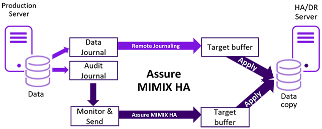

**Built on IBM’s remote journaling**

<li>Replicates changed data in real time
<li>Minimizes bandwidth usage
<li>MIMIX change data capture replicates non-journaled data

**Flexible and platform independent**

<li>Supports mixed hardware, storage and IBM i OS version

**Optimized for performance**

<li>Delivers near-zero RPO (zero with synchronous Remote Journaling)
<li>Provides near-zero RTO by maintaining a hot, switch-ready backup
<li>Performance tuning features optimize performance for your environment (e.g. parallel applies and database caching)
<li>Active-active replication with built-in conflict resolution delivers RTO in seconds (as quickly as moving users to another active server)
</li>
