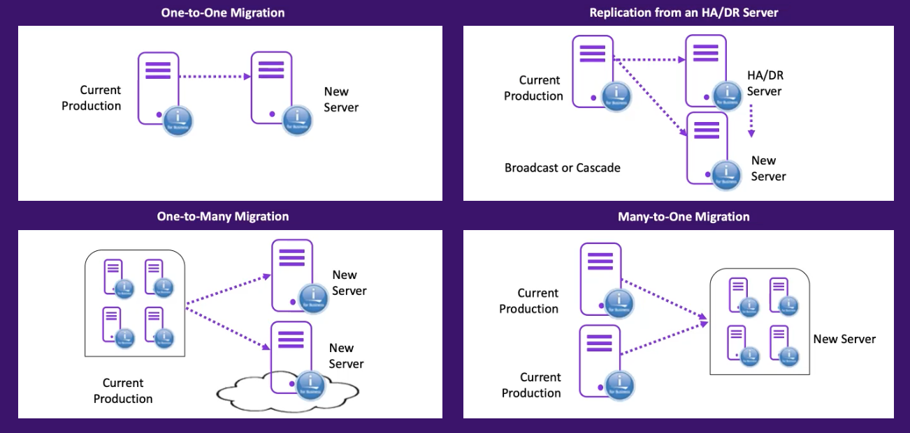
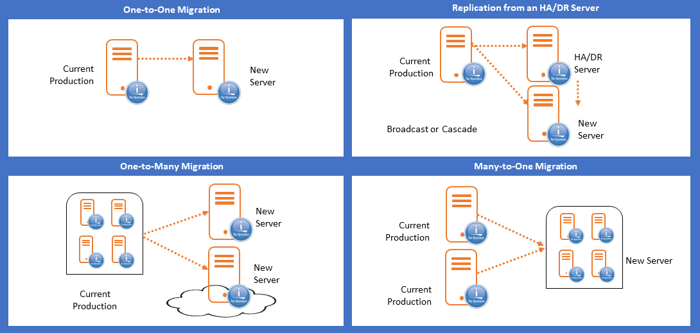
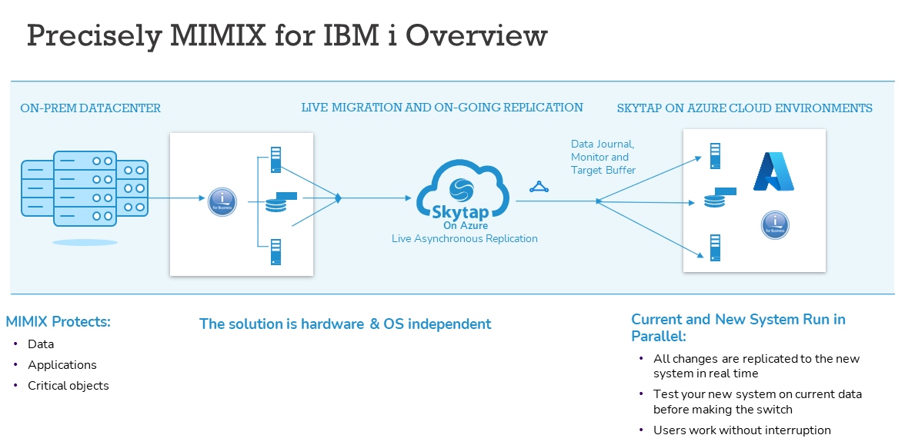
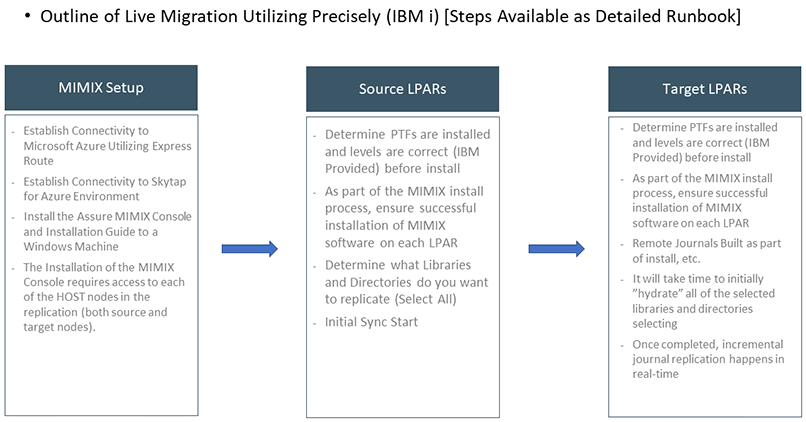
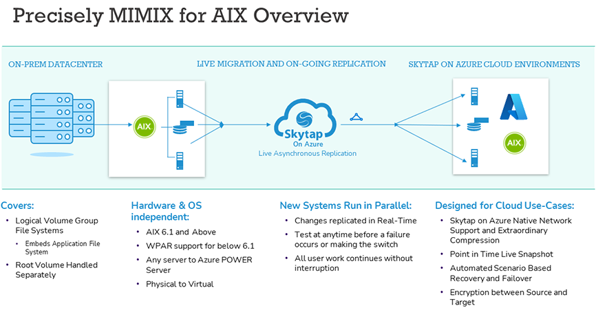
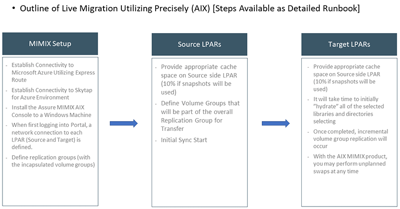

## Skytap on Azure + Precisely for High Availability Scenarios

For hot migrations, Skytap partners with Precisely, the market leader
for high availability scenarios. Precisely support IBM i and AIX. How
Precisely supports the Skytap on Azure hot migration for IBM i is
depicted below.

<b>Quick Recap: What is Precisely?</b>

<li> MIMIX is the most prevalent tool used in RPO scenarios of near-zero

<li> Easy to Package – Support for both AIX and IBM I

<li> Automated Role Swaps Allow for Testing, Operations Upgrades in Prod

<li> AIX Solution Provides Live Snapshot Capability for Any Subsidiary Environment Seeding

</li>

This is built on IBM's remote journaling which replicates changed data
in real-time and minimizes bandwidth usage. The MIMX change data capture
replicates non-journaled data. This solution is flexible and platform
independent because it supports mixed hardware, storage and IBM I OS
version. It is also optimized for performance because it:

-   delivers near-zero RPO (zero with synchronous Remote Journaling)

-   provides near-zero RTO by maintaining a hot, switch-ready back up

-   includes performance tuning features to optimize performance for
    your environment (i.e parallel applies and database caching)

-   has active-active replication with built-in conflict resolution that
    delivers RTO in seconds (as quickly as moving users to another
    active server)

The following outlines popular Precisely migration scenarios available
for you to consider:

**Built on IBM’s remote journaling**

<li>Replicates changed data in real time
<li>Minimizes bandwidth usage
<li>MIMIX change data capture replicates non-journaled data

**Flexible and platform independent**

<li>Supports mixed hardware, storage and IBM i OS version

**Optimized for performance**

<li>Delivers near-zero RPO (zero with synchronous Remote Journaling)
<li>Provides near-zero RTO by maintaining a hot, switch-ready backup
<li>Performance tuning features optimize performance for your environment (e.g. parallel applies and database caching)
<li>Active-active replication with built-in conflict resolution delivers RTO in seconds (as quickly as moving users to another active server)
</li>

**Whats different about AIX?**
<li>The AIX Mimix Product focuses on Volume Group replication and sync
<li>Any applications encapsulated in the Volume Group are included as part of the replication
<li>The Root Volume Group is NOT Replicated (Needs to be Handled Separately) [There are some known scripts for handling initial sync of Root Volume Group]
<li>Point in Time Snapshot of Volume Groups
<li>Inline Encryption

## Addtional Solutions

- **[Skytap Live Clone Feature](liveclone.md)**

### Next steps

**Main Overview**
> [Skytap Well-Architected Framework](../../README.md)

**Operational Excellence**
>[Skytap Operational Excellence Pillar](../../operations/README.md)

**Resiliency**
> [Skytap Resiliency Pillar](../README.md)

>**Migration Solutions**
>* [Cold (Warm) Migrations (Backup and Restore)](ColdMigrationsOverview.md)

>**Design**
>* [Design Considerations for Azure](../designconsiderationsazure.md)
<!-- 
>* [Design Considerations for IBM Cloud](../designconsiderationsibm.md)
-->

**Security**
> * [Skytap Security Pillar](../../security/README.md)
