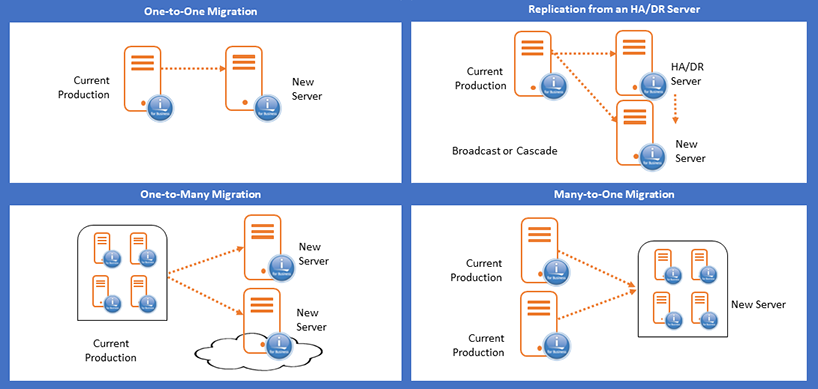

Quick Recap: What is Precisely?

MIMIX is the most prevalent tool used in RPO scenarios of near-zero

Easy to Package – Support for both AIX and IBM I

Automated Role Swaps Allow for Testing, Operations Upgrades in Prod

AIX Solution Provides Live Snapshot Capability for Any Subsidiary Environment Seeding

**Built on IBM’s remote journaling**

<li>Replicates changed data in real time
<li>Minimizes bandwidth usage
<li>MIMIX change data capture replicates non-journaled data

**Flexible and platform independent**

<li>Supports mixed hardware, storage and IBM i OS version

**Optimized for performance**

<li>Delivers near-zero RPO (zero with synchronous Remote Journaling)
<li>Provides near-zero RTO by maintaining a hot, switch-ready backup
<li>Performance tuning features optimize performance for your environment (e.g. parallel applies and database caching)
<li>Active-active replication with built-in conflict resolution delivers RTO in seconds (as quickly as moving users to another active server)
</li>

**Whats different about AIX?**
<li>The AIX Mimix Product focuses on Volume Group replication and sync
<li>Any applications encapsulated in the Volume Group are included as part of the replication
<li>The Root Volume Group is NOT Replicated (Needs to be Handled Separately) [There are some known scripts for handling initial sync of Root Volume Group]
<li>Point in Time Snapshot of Volume Groups
<li>Inline Encryption

**Skytap Live Clone** 

Within Skytap, Environments and Templates are very important concepts. An Environment is an object that comprises one or more VMs, one or more networks, plus configuration settings and metadata. A Template is a read-only copy of an environment that can be used to back up critical environments and acts like a blueprint for new environments. Environments can be copied, and they can be saved as a template. 

Until recently, if an environment contained running VMs it couldn’t be copied or saved as a template until those VMs were shutdown or suspended (x86 only). 

With Skytap's new live clone capability, environments can be copied or saved while VMs remain running. The VMs in the copy or template will be powered off, but the original VMs will continue to run without interruption. 

The new Skytap live clone feature is designed for customers running applications that need to be backed-up or archived, but cannot afford the time it takes to shut down the VMs, create the copy or save as a template, run them, and bring the application back online. With the new Skytap live clone feature, the copy/save happens nearly instantaneously and you eliminate the time it takes to shutdown and start-up the VMs. 

[embed]https://vimeo.com/641622590/64242ce57a[/embed]
<h2><b>How it works</b></h2>
There are some considerations to be aware of when using Skytap live clone. The storage for each VM is being cloned by the Skytap storage platform and has no knowledge or concern for what is running within the VM. To ensure the copy of the VMs is consistent and not corrupted, we strongly recommend you quiesce VM activity. The safest level of quiesce is to shutdown the VM, but if you need to leave VMs running we recommend putting the VM into a consistent state. This includes actions like placing databases into read-only or back-up mode and freezing data volumes to ensure all transactions are written to disk before the copy is performed. You can read more about quiescing VM activity in this <a href="https://help.skytap.com/quiescing-vm-activity.html">help topic</a>.

With a bit of scripting and ingenuity, these operations can be automated. The way to approach this is to designate a VM within the environment as the controller. A script running on this VM remotely connects to each of the other VMs in the environment and quiesces the VM as appropriate. The script then calls the Skytap API to copy or save the environment. Once the copy or save operation is complete, the script again remotely connects to each VM and returns it to normal operations. This entire operation should take just a few minutes. The application will be unavailable during this brief period, but you end up with an exact copy of your entire application and networking configuration, so the brief downtime is well worth it.

What is particularly exciting about this new feature is you get an instant copy or read-only template of the entire application with one action: all VMs, networks, and other configuration information. You can copy the template to another Skytap region for disaster recovery. You could run the copy of the environment to perform backups, troubleshooting issues, or use it as a target for read-only reporting.

Watch the demo video above to see live clone in action.