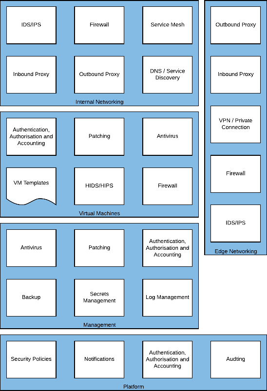
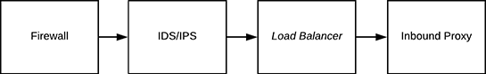
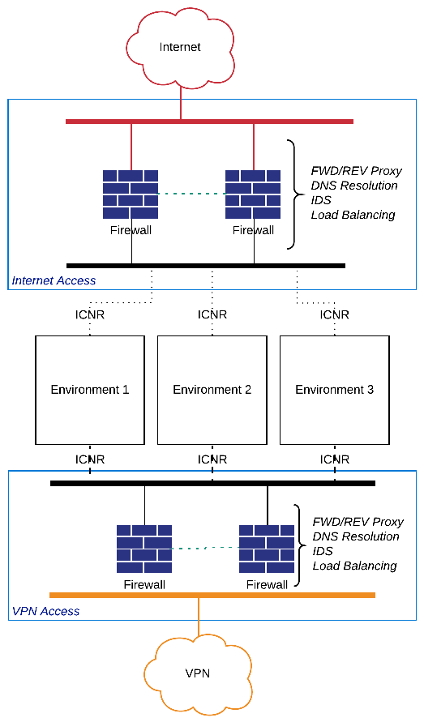
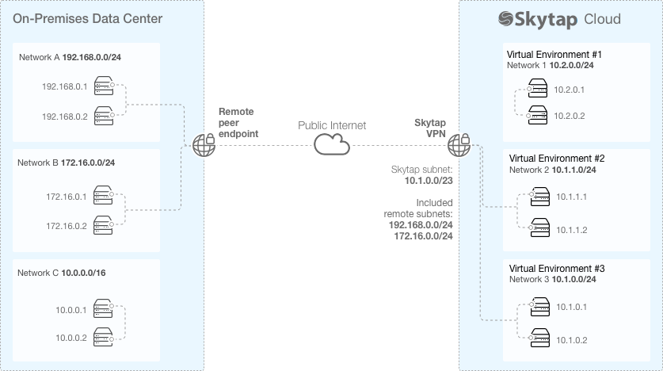
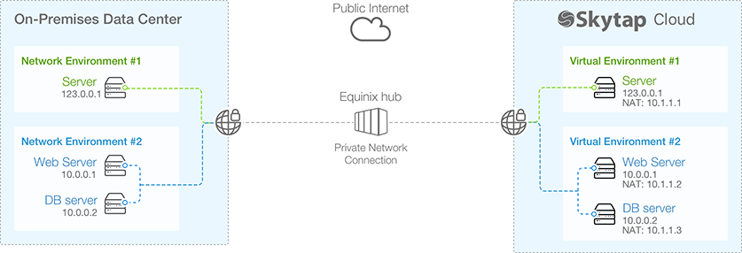

## Edge Networking

The Edge Networking capability provides access to resources outside of
the immediate environment in Skytap, and as such, represents a
significant area of exposure. Workloads running in the cloud have
legitimate needs to access services or resources either on the Internet
or behind the corporate network. To do this safely and efficiently
consolidating this ingress and egress into a centralised service can
help to enforce good practice and reduce risk.

The Outbound Proxy and Inbound Proxy filter is what Virtual Machines can
connect to and what in turn can connect to them. For example, an
Outbound Proxy may be configured to allow an Application Server to
request data from a public API; whereas, an Inbound Proxy (sometimes
called a protocol break) terminates external client connections to
protect the internal servers from direct internet exposure. The Inbound
Proxy can then perform validation on the request from the client, such
as determining if the client is a known bad actor or if the request is
appropriately formed.

The VPN or Private Connection provides secure and restricted
connectivity to on-premises or third-party cloud access in a controlled
manner. For example, only the Production environment may be allowed to
communicate over the Private Connection to the database running
on-premises; however, the Development/Test environments can be connected
to by the Engineering team via VPN.

Firewalls, Intrusion Detection Systems (IDS) and Intrusion Prevention
Systems (IPS) are typically consolidated onto a single device, but they
do provide distinctly different functionality. A Firewall can restrict
connectivity between devices based on source or destination information
sent with the traffic. In contrast, an IDS/IPS attempts to understand
the context of the traffic passing through and responds accordingly. The
IDS/IPS is designed to detect unauthorised intrusions on your network by
matching traffic flows to known signatures

When providing Internet or VPN access, this stack is typically
implemented, as below. With the reverse being true for outbound traffic.

*Figure 11 - Typical Traffic Flow*[^1]

#### Example High Level Design

*Figure 12 - Example Internet and VPN Connection Scheme*

#### Outbound Proxy

An Outbound Proxy on the network edge should be configured to restrict
access to websites, Internet-connected services and external services to
only what is required for typical operation. For example, connection to
an application or operating systems update service is appropriate. An
outbound proxy can also be used for Data Loss Prevention (DLP) policy
enforcement.

##### Supported Implementations

  ----------------------------------------------------------------------------------- ------------- -------------------------------------
  Application                                                                         Vendor        Reference Architecture

                                                                                                    

  [[Squid]{.ul}](http://www.squid-cache.org/)                                         Squid         

  [[Web                                                                               McAfee        
  Gateway]{.ul}](https://www.mcafee.com/enterprise/en-gb/products/web-gateway.html)                 
  ----------------------------------------------------------------------------------- ------------- -------------------------------------

#### Inbound Proxy

The Inbound Proxy sometimes referred to as Reverse Proxy, sits between
the client and the webserver or application server hosted in Skytap. A
reverse proxy accepts a request from a client, forwards it to a server
that can fulfil it, and returns the server's response to the client.

The proxy enhances security by shielding the backend servers from the
outside network, and this prevents malicious clients from accessing them
directly to exploit any known vulnerabilities. It can also protect these
backend servers by rejecting traffic from blacklisted IPs or rating
limiting the number of connections from clients, reducing the risk of a
distributed denial-of-service (DDoS) attack.

##### Supported Implementations

  ----------------------------------------------------------------------------------- ------------- ----------------------------------------
  Application                                                                         Vendor        Reference Architecture

                                                                                                    

  [[NGINX]{.ul}](https://www.nginx.com/)                                              F5            

  [[BIG IP]{.ul}](https://www.f5.com/products/big-ip-services)                        F5            

  [[Squid]{.ul}](http://www.squid-cache.org/)                                         Squid         

  [[pfSense]{.ul}](https://www.netgate.com/solutions/pfsense/)                        Netgate       

  [[MVision                                                                           McAfee        
  Cloud]{.ul}](https://www.mcafee.com/enterprise/en-us/products/mvision-cloud.html)                 
  ----------------------------------------------------------------------------------- ------------- ----------------------------------------

#### VPN / Private Connection

Skytap supports Site-to-Site VPN as well as Private Network Connections
(PNCs) using [[Azure
ExpressRoute]{.ul}](https://azure.microsoft.com/en-gb/services/expressroute/)
and [[Equinix Cloud
Exchange]{.ul}](https://www.equinix.com/solutions/cloud-infrastructure/public-cloud/connectivity/).

##### Site-to-Site VPN

The Skytap [[Site-to-Site
VPN]{.ul}](https://help.skytap.com/vpn-configuration-parameters.html#VPNconfigurationoptions)
supports an IPSec VPN using IKEv1 or IKEv2 using Pre-Shared Keys (PSK),
AES 256 bit and Perfect Forward Secrecy (PFS).

The Skytap Site-to-Site VPN secures traffic that traverses the public
Internet, but not private connectivity. Multiple VPNs can be created for
high availability and to connect multiple corporate data centres to the
Skytap cloud.

*Figure 13 - Example VPN Connection Scheme*

##### Private Network Connection (PNC)

An Azure ExpressRoute or Equinix Cloud Hub connection are referred to as
Private Network Connections (PNCs) in Skytap.

In the example below, the PNC connects the on-premises data centre with
the Skytap cloud environments. It should be noted that while this
connection is private, using Multiprotocol Label Switching (MPLS), which
logically isolates traffic, it is not however encrypted.

{width="7.5in"
height="2.6527777777777777in"}

*Figure 14 - Example Private Connection Scheme*

When a PNC is used traffic between Skytap and the On-premises datacentre
or other cloud providers should be encrypted at the edge of the
environment using a Firewall to create the site-to-site connection or by
using point to point encryption from a service mesh network. Service
Mesh networking is covered in the **Internal Networking** section of
this document.

#### Firewall

A Firewall should be implemented to protect the edge of the Skytap
platform, both to defend the workloads running in Skytap but also any
onward connection to the corporate datacentre or other clouds.

Internet to Environments filtering should take place to only permit
acceptable connections, for example, HTTPS connection to the Inbound
Proxy but discard all other forms of traffic attempting to connect to
Environments directly.

Environments to Internet filtering should restrict egress of traffic
except via the Outbound Proxy; the proxy decides as to what external
sites and services are acceptable.

VPN/PNC to Environments, blanket access to Environments even from
private connections such as VPNs is inadvisable. Outside of machine to
machine connectivity to support application operations, such as Database
calls or Directory Lookups, user access should be brokered via a
Jump/Bastion host held in the Management environment.

##### Supported Implementations

  -------------------------------------------------------------- ------------- ----------------------------------------
  Application                                                    Vendor        Reference Architecture

                                                                               

  [[pfSense]{.ul}](https://www.netgate.com/solutions/pfsense/)   Netgate       

  [[BIG-IP]{.ul}](https://www.f5.com/products/big-ip-services)   F5            
  -------------------------------------------------------------- ------------- ----------------------------------------

#### Intrusion Detection System / Intrusion Prevention System

Typically Intrusion Detection Systems or Intrusion Prevention Systems
are consolidated on the firewall but shown here as a discrete capability
for completeness. The IDS/IPS performs a vital monitoring function to
alert administrators and security personnel of unauthorised attempts to
access the network. Intrusion is of particular concern with
internet-facing applications.

In Skytap an IDS/IPS must be placed in line with the traffic as port
mirroring is not supported, hence the preference to include it as part
of the Firewall capability.

##### Supported Implementations

  -------------------------------------------------------------------------------------------------- ------------- ----------------------------------------
  Application                                                                                        Vendor        Reference Architecture

                                                                                                                   

  [[pfSense]{.ul}](https://www.netgate.com/solutions/pfsense/)                                       Netgate       

  [[Network Security                                                                                 McAfee        
  Platform]{.ul}](https://www.mcafee.com/enterprise/en-gb/products/network-security-platform.html)                 

  [[Next Gen                                                                                         Palo Alto     
  Firewall]{.ul}](https://www.paloaltonetworks.com/network-security/next-generation-firewall)                      
  -------------------------------------------------------------------------------------------------- ------------- ----------------------------------------

[^1]: A Load Balancer is shown for reference but is not within the scope
    of this document.

## Next steps

* [Security Overview](./README.md)  
* [Key Security Areas](./keysecurityareas.md)

* [Security Management](./securitymanagement.md)  

* [Virtual Machines](./virtualmachines.md) 

* [Internal Networking](./internalnetworking.md) 

* [Security as a Service](./securityasaservice.md) 