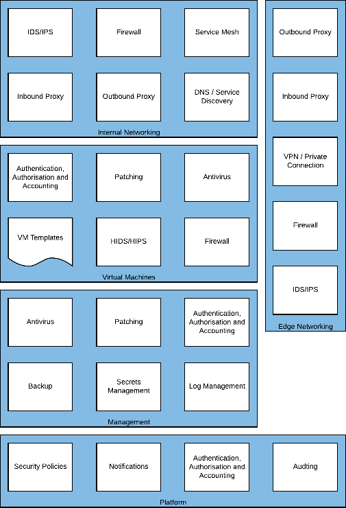

Internal Networking

Several of these architectural building blocks are duplicated in the
Edge Networking section and this is by design, each environment should
be secured independently of each other by creating a defense in depth
approach. This means that if one layer is compromised the crown jewels
will still be secure.

{width="4.053839676290464in"
height="2.1838888888888888in"}

*Figure 15 -- Internal Networking Required Capabilities*

Two additional services present in the environment internal networking,
a Service Mesh and DNS/Service Discovery. A Service Mesh allows for
secured communication between application components or virtual
machines, though typically microservices, but can also fulfil some of
the functionality of a firewall. DNS and Service Discovery allows the
automated discovery of application services within an environment, for
example Domain Services.

#### Example High Level Design

Drawing

##### 

#### Firewall

Internal network firewalls can be deployed where it is necessary to
restrict or control traffic between networks running inside Skytap.
These firewalls are deployed as virtual machines within your Skytap
environments.

##### Supported Implementations

  -------------------------------------------------------------- ------------- ----------------------------------------
  Application                                                    Vendor        Reference Architecture

                                                                               

  [[pfSense]{.ul}](https://www.netgate.com/solutions/pfsense/)   Netgate       

                                                                 F5            
  -------------------------------------------------------------- ------------- ----------------------------------------

#### Service Mesh

A Service Mesh can connect multiple application components or
microservices together in a way that simplifies their use. For example,
a Database running on AIX in Skytap could be connected to a frontend
application hosted in a Hyperscale cloud provider without having to
manually configure routing at each layer.

{width="2.932292213473316in"
height="2.837594050743657in"}

In addition to network simplification a Service Mesh can also provide
fine-grained access control, mutual TLS authentication and remove
network appliances (such as load balancers).

##### Supported Implementations

  -------------------------------------------------------------------------- ----------- --------- ----- ------- ----- ----- ------------------
  Application                                                                Vendor      x86             Power               Reference
                                                                                                                             Architecture

                                                                                         Windows         Linux   AIX   IBM i Linux

  [[Consul]{.ul}](https://www.hashicorp.com/products/consul/service-mesh/)   HashiCorp   ✔️                                  

                                                                                                                             

                                                                                                                             
  -------------------------------------------------------------------------- ----------- --------- ----- ------- ----- ----- ------------------

#### DNS/Service Discovery

Within an environment a DNS service can be used to provide information
to applications on where to send traffic without using the IP address.
This is beneficial on the Skytap platform even though IP address
portability is supported, in case multiple concurrent environments are
running.

Service Discovery helps applications discover other services they
require, but can also validate that the endpoints are healthy before
directing traffic. Service Discovery can also replace some load
balancing functionality.

{width="2.625in"
height="2.710275590551181in"}

##### Supported Implementations

  ---------------------------------------------------------------------------------------------------------- ----------- --------- ----- ---------------------------------
  Application                                                                                                Vendor      x86             Reference Architecture

                                                                                                                         Windows         Linux

  [[Consul]{.ul}](https://www.hashicorp.com/products/consul/service-discovery/)                              HashiCorp   ✔️              

  Active Directory                                                                                           Microsoft                   

  [[Umbrella]{.ul}](https://umbrella.cisco.com/?_ga=2.214455253.393431820.1607963050-217404651.1607963050)   Cisco                       
  ---------------------------------------------------------------------------------------------------------- ----------- --------- ----- ---------------------------------

#### Outbound Proxy

Outbound proxies can also be configured directly within your workload
networks if needed to provide a layered security stance or if the
workload requires it. This kind of proxy type of proxy is commonly used
with stand-alone workloads where an application is expected to function
in isolation.

##### Supported Implementations

  -------------------- ------------- -------------------------------------
  Application          Vendor        Reference Architecture

                                     

                                     

                                     
  -------------------- ------------- -------------------------------------

#### Inbound Proxy

Inbound proxies deployed within a workload environment are typically
used to handle proxying required within a workload or between workload
environments.

##### Supported Implementations

  -------------------------------------------------------------- ------------- ----------------------------------------
  Application                                                    Vendor        Reference Architecture

                                                                               

  [[NGINX]{.ul}](https://www.nginx.com/)                         F5            

  [[Squid]{.ul}](http://www.squid-cache.org/)                    Squid         

  [[pfSense]{.ul}](https://www.netgate.com/solutions/pfsense/)   Netgate       
  -------------------------------------------------------------- ------------- ----------------------------------------
