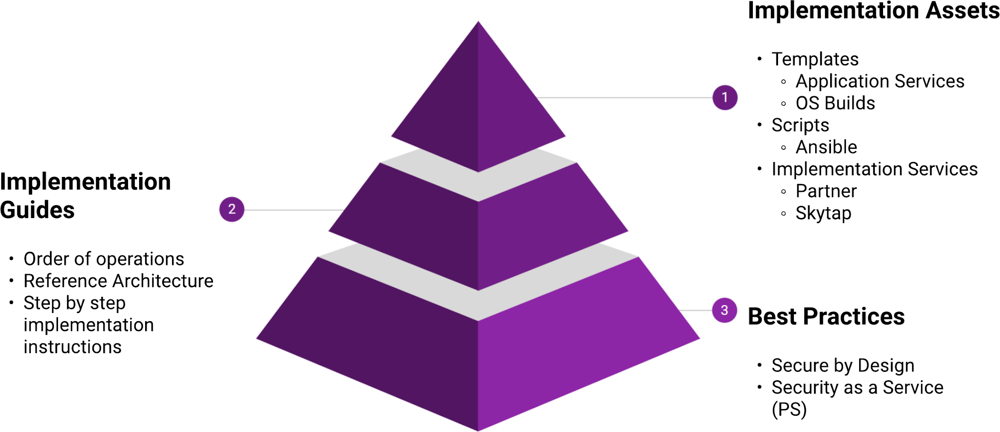

 
# Security Overview

Securely running workloads in a cloud environment requires a
multi-layered approach which covers both how workloads are deployed and
maintained within your account and the management of your Skytap account
itself. This document outlines architectural elements necessary to
achieve a robust implementation on the Skytap platform and best
practices for how your Skytap account should be configured.

*Figure 1 - Control Map*

Assets you deploy into your account should be defined by implementation
standards based on your use cases and requirements while taking into
account best practices of how to leverage Skytap. Each layer in this
model is built on the capabilities delivered in the layer below; you
cannot know how to secure a virtual machine without understanding how
they can be secured and why they need to be.

Accompanying this document is a **Skytap - Security Controls Workbook**
that should be referred to as you develop your High-Level Designs and
Low-Level Designs. It outlines each area discussed herein with specific
controls that should be applied. It also contains an example of a Risks
and Mitigations register that should be considered as part of any cloud
project.

Similar to other cloud services, Skytap operates a shared responsibility
model with regards to security. Skytap is accountable for the platform
and customers are accountable for the way they use that platform.

*Figure 2 -- Shared Responsibility Model*

Additionally, resources deployed into Skytap should have clearly a
clearly defined operating model:

-   Who is responsible for creation/deletion of virtual machines?

-   Who is responsible for updating the application/data on your virtual
    machines?

-   Who can provide common services support on the virtual machines?

-   Are there services external to Skytap that need to be supported for
    your workloads?

-   Which of your existing operating models need to change for new cloud
    workloads?

Most organizations will have multiple cloud vendors, supported by
systems integrators or outsourced management functions. Cloud platforms
need to be managed holistically but controls applied specifically, for
example, all logging across your organisation should be consolidated
into a single Security Incident Event Monitoring (SIEM) system and the
approach to management and remediation will be defined by the workload
and platform.

## Next steps

* [Key Security Areas](./keysecurityareas.md)

* [Security Management](./securitymanagement.md)  
