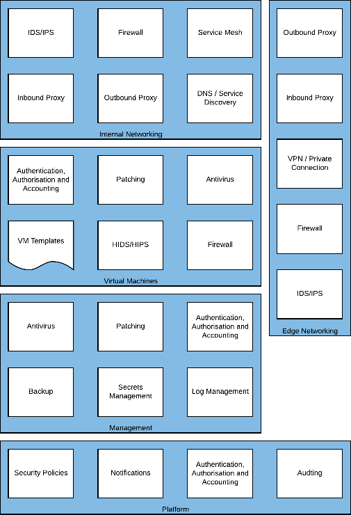
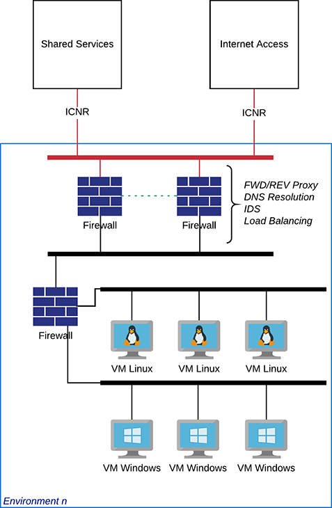

### Virtual Machines

The Virtual Machines capability encompasses VM Templates;
Authentication, Authorisation and Accounting; Patching; Antivirus;
HIDS/HIPS; and Firewall. This area relates to the Environments running
in Skytap and any templates associated with them.

*Figure 15 -- Virtual Machine Required Capabilities*

#### VM Templates

In Skytap the Virtual Machine template contains a point in time and
idempotent copy of an entire Environment. An Environment or Template
includes any connectivity it may have, such as Internet access or VPN
connections, the state of any x86 or Power Virtual Machines (LPARs)
including their memory state (if x86), disks, MAC addresses and other
configuration items.

Pre-configured templates should be made available to users of the Skytap
platform that conform to organisational security policies. These
templates should have pre-installed anti-virus and Host-Based Intrusion
Detection Systems/Host-Based Intrusion Prevention Systems; installed
licenses; up to date patching for security vulnerabilities of operating
systems and applications; and an enabled Firewall.

From these base templates or Golden Images, users on the Skytap platform
can build or operate their workloads from a known good configuration.
The use of Golden Images prevents accidental misconfiguration or
unauthorised use of operating systems which may not align with
organisational standards or software licensing exposure.

These base templates can be made available to users via Projects, as
described earlier in this document.

#### Authentication, Authorisation and Accounting

Access to Virtual Machines and LPARs in Skytap Environments should be
centralised, and the use of a directory service enables that. A local
directory server, in the Environment, can be made available to Virtual
Machines and LPARs or authentication traffic can be passed to the Shared
Services environment.

Password-based authentication should be avoided in most cases, with
public/private key being preferred. Certificate authentication for users
is atypical in Windows deployments but is supportable and considerably
more secure.

Lightweight Directory Access Protocol (LPAP) is a supported
authentication technology on Linux, IBM i and AIX.

Terminal access should be protected with certificates, SSH can be
configured to use signed certificates validated by the Secrets Manager
and should be used to reduce key reuse and automated repudiation of
compromised keys or users no longer with authority to connect. With IBM
i the TN5250 'Green-Screen' service should be secured using SSL/TLS
certificates, some guidance is documented
[[here]{.ul}](https://www.ibm.com/support/pages/configuring-ssl-telnet-and-host-servers-server-authentication-first-time),
as the Green-Screen is a telnet based session which has no encryption
and is susceptible to interception and exploitation.

##### Supported Implementations

  ------------- ----------- --------- ----- ------- ----- ----- -------------------
  Application   Vendor      x86             Power               Reference
                                                                Architecture

                            Windows         Linux   AIX   IBM i Linux

  Active        Microsoft   ✔️        ✔️    ✔️            ✔️    
  Directory                                                     

  LDAP                                                          

  SAML 2.0                                                      
  ------------- ----------- --------- ----- ------- ----- ----- -------------------

#### Patching

The regular updating of operating systems and applications with security
patches prevents vulnerabilities being exposed and exploited by bad
actors. A patching service should be configured to regularly apply new
security patches, these patches should also be integrated into any
master/gold templates in use on the Skytap platform.

##### Supported Implementations

  -------------- ----------- --------- ----- ------- ----- ----- ------------------
  Application    Vendor      x86             Power               Reference
                                                                 Architecture

                             Windows         Linux   AIX   IBM i Linux

  Ansible        Red Hat     ✔️        ✔️    ✔️            ✔️    

  Windows Update Microsoft   ✔️                                  

                                                                 
  -------------- ----------- --------- ----- ------- ----- ----- ------------------

#### Antivirus

All Virtual Machines and LPARs should have Antivirus protecting them,
they should be configured to update regularly (hourly), scan frequently
and report any events centrally.

##### Supported Implementations

  ------------- ------------- --------- ------ ------- ----- ----- ------------------
  Application   Vendor        x86              Power               Reference
                                                                   Architecture

                              Windows          Linux   AIX   IBM i Linux

                Trend         ✔️        ✔️     ✔️                  

                HelpSystems                            ✔️          

                Sophos        ✔️        ✔️     ✔️            ✔️    
  ------------- ------------- --------- ------ ------- ----- ----- ------------------

#### HIDS/HIPS

A Host-Based Intrusion Detection System or Host-Based Intrusion
Prevention System can help to secure against unauthorised access.

Typically these applications detect malicious login traffic, changes to
privileged files or the installation of software outside the approved
process. Logs generated from these systems should be centralised, with
the potential to invoke automated defences such as quarantine.

In some production systems, any direct login to a Virtual Machine or
LPAR is considered an attack and would cause the VM to self-destruct.

##### Supported Implementations

  ------------- ---------- --------- ------ ------- ----- ------- ------------------
  Application   Vendor     x86              Power                 Reference
                                                                  Architecture

                           Windows          Linux   AIX   IBM i   Linux

  Fail2Ban                           ✔️                   ✔️      

  TripWire      Tripwire   ✔️        ✔️     ✔️            ✔️      
  Enterprise                                                      

                TrapX      ✔️        ✔️                   ✔️      
  ------------- ---------- --------- ------ ------- ----- ------- ------------------

#### OS Firewall

Skytap enables local network communication by default and OS level
firewall protection should be enabled to restrict open ports only to
those that are approved. For example, a database server should only
allow database traffic from known application servers; any other
attempts to connect to a database management port should be ignored and
reported.

Supported Implementations

  -------------- ----------- --------- ----- ------- ----- ----- ------------------
  Application    Vendor      x86             Power               Reference
                                                                 Architecture

                             Windows         Linux   AIX   IBM i Linux

  Windows        Microsoft   ✔️                                  
  Firewall                                                       

  iptables       N/A                   ✔️                  ✔️    

  ipfilters      IBM                         ✔️                  
  -------------- ----------- --------- ----- ------- ----- ----- ------------------

#### Example High Level Design

{width="5.60416447944007in"
height="8.240279965004374in"}

## Next steps

* [Security Overview](./README.md)

* [Key Security Areas](./keysecurityareas.md)

* [Security Management](./securitymanagement.md)  

* [Edge Networking](./edgenetworking.md) 

* [Internal Networking](./internalnetworking.md) 

* [Security as a Service](./securityasaservice.md) 
